DEG Analysis
================
Adam Steinbrenner
August 11, 2021

## Install packages if needed

    install.packages("ggalluvial")
    install.packages("ggplot2")
    install.packages("alluvial")
    install.packages("readr")
    install.packages("rmarkdown")
    install.packages("knitr")
    install.packages("xfun")
    install.packages("eulerr")

## Load libraries

## load data

``` r
#Load DESeq output
setwd("C:/Users/Adams/Dropbox/00_UCSD/manuscript/transcriptome/scripts/deseq")
deseq_input <- read_csv("DESeq_allcomps_alluv.csv", show_col_types = FALSE)
```

    ## New names:
    ## * `` -> ...1

``` r
#Load cowpea gene annotations
annotations <- read_csv("input_annotations.csv", show_col_types = FALSE)
setwd("C:/Users/Adams/Dropbox/00_UCSD/manuscript/transcriptome/scripts")

#Load raw counts data
counts <- read_csv("counts_avg_log2.csv", show_col_types = FALSE)
```

\#190603 plotting parameters

``` r
#the script gives each gene*comp row a "class" depending on meeting significance and fold change thresholds.  Then dplyrfilters by certain class*comparison criteria
pval <- 0.05
higher <- 1
high <- 1
lower <- -1 #to exclude downreg, just make this threshold large
low <- -1
otherwise <- "less than 1"

#plotting parameters -- colors for upregulated genes
color0<-"#F3E207"
color1<-"darkgoldenrod1" #lightorange
color2<-"darkorange1"
color3<-"lightgoldenrod2"
color35<-"salmon1"
color4<-"red1"
color5<-"firebrick"
color6<-"tomato2" #darkred
color7<-"grey"

#Sets the log2FC limits for graphs
ylim<-c(-4,10)

boxplot_font_size <- 18


boxplot_theme <- theme_minimal() + 
  theme(legend.position = "none", 
        panel.grid.major = element_blank(), 
        panel.grid.minor = element_blank(),
        panel.background = element_blank(), 
        axis.line = element_line(colour = "black"),
        axis.text.x = element_text(size=boxplot_font_size),
        axis.text.y = element_text(size=boxplot_font_size),
        axis.title.y = element_text(size=boxplot_font_size),
        plot.title = element_text(size=boxplot_font_size),
        axis.title.x=element_blank())
```

### Place each DESeq comparison into a type “class” based on “high / higher” and “low / lower” thresholds above.

#### (An old version displayed divided DEGs based on two classes of log2FC, high and higher)

``` r
deseq_input <- mutate(deseq_input, 
                      relMean = log2(baseMean*2^(log2FoldChange)/baseMean),
                      sig = ifelse(padj < pval,1,0),
                      class = ifelse(is.na(sig),otherwise,
                    ifelse(sig==1,
                      ifelse(log2FoldChange>higher,higher,
                      ifelse(log2FoldChange>high,high,
                      ifelse(log2FoldChange<lower,lower,
                      ifelse(log2FoldChange<low,low,otherwise)))),otherwise))
                        )
```

### Fig. S2: Alluvial diagram

``` r
require(scales)
numcomp <- 2
comp1 <- "H1U1"
comp2 <- "I1U1"
alluv_set <- deseq_input %>% filter(comp==comp1 | comp==comp2) %>% mutate(cat="up") %>% mutate_at("class",str_replace,"less than 1","3_n.s.") %>% mutate_at("class",str_replace,"-1","2_down") %>% mutate_at("class",str_replace,"1","1_up") %>% group_by(gene,class) %>% filter(class!="3_n.s." | n()<numcomp) 

alluv1 <- ggplot(alluv_set,
  aes(x=comp, stratum = class, alluvium = id, y = id,label=class,fill=class)) + 
  geom_flow() + 
  geom_stratum(alpha = .5) +
  geom_text(stat = "stratum", size = 3) +

  theme_classic() +
  scale_y_continuous(labels=NULL, expand=c(0,0)) + 
  scale_fill_manual(
  #5 colors for the 5 classes; change if you want a different number
  values = c("green1", "blue1", "grey50", "grey60")) +
  guides(fill=guide_legend(title="log2(FC)")) +
  #Corrects the order of x categories
  scale_x_discrete(limits = c(comp1,comp2)) +
  #counts and prints as the ylabel the number of remaining datapoints within a single comparison axis
    theme(legend.position = "none") +
  ylab(paste(nrow(filter(alluv_set,comp==comp1)),"differentially expressed genes")) 

#Visualize the alluvial diagram
alluv1
```

    ## Warning: The `.dots` argument of `group_by()` is deprecated as of dplyr 1.0.0.

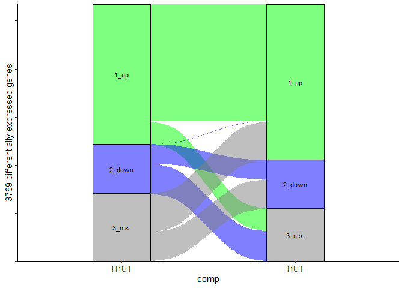<!-- -->

``` r
numcomp <- 2
comp1 <- "H6U1"
comp2 <- "I6U1"
alluv_set <- deseq_input %>% filter(comp==comp1 | comp==comp2) %>% mutate(cat="up") %>% mutate_at("class",str_replace,"less than 1","3_n.s.") %>% mutate_at("class",str_replace,"-1","2_down") %>% mutate_at("class",str_replace,"1","1_up") %>% group_by(gene,class) %>% filter(class!="3_n.s." | n()<numcomp) 

alluv6 <- ggplot(alluv_set,
  aes(x=comp, stratum = class, alluvium = id, y = id,label=class,fill=class)) + 
  geom_flow() + 
  geom_stratum(alpha = .5) +
  geom_text(stat = "stratum", size = 3) +
  theme(legend.position = "none") +
  theme_classic() +
  scale_y_continuous(labels=NULL, expand=c(0,0)) + 
  scale_fill_manual(
  #5 colors for the 5 classes; change if you want a different number
  values = c("green1", "blue1", "grey50", "grey60")) +
  guides(fill=guide_legend(title="log2(FC)")) +
  #Corrects the order of x categories
  scale_x_discrete(limits = c(comp1,comp2)) +
  #counts and prints as the ylabel the number of remaining datapoints within a single comparison axis
  theme(legend.position = "none") +
  ylab(paste(nrow(filter(alluv_set,comp==comp1)),"differentially expressed genes"))

#Visualize the alluvial diagram
alluv6
```

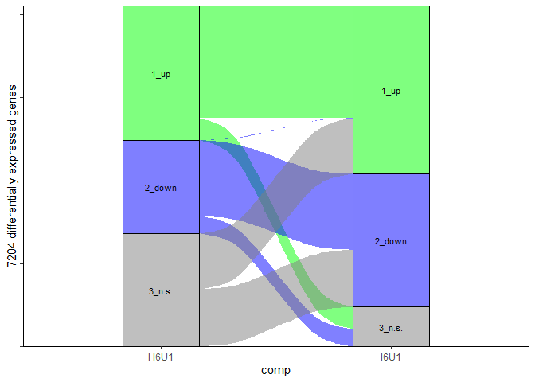<!-- -->

``` r
#height is scaled to the number of DEGs
ggsave("boxplots/FigS2A_alluvial.png",alluv1,width=7.3,height=5)
ggsave("boxplots/FigS2BalluvS1B.png",alluv6,width=7.3,height=9.55)
```

# Fig 1B histograms

``` r
hist1 <- deseq_input %>% filter(comp=="H1U1" & class==1)
hist2 <- deseq_input %>% filter(comp=="I1U1" & class==1)
hist3 <- deseq_input %>% filter(comp=="H6U1" & class==1)
hist4 <- deseq_input %>% filter(comp=="I6U1" & class==1)

test_theme <- theme(
  axis.text.x = element_text(size=18,angle=45,hjust=1),
  axis.text.y = element_text(size=18 ),
  axis.title.y = element_text(size=18),
  plot.title = element_text(size = 18, face = "bold"))

histogram <- data.frame("DEG"= c(nrow(hist1),nrow(hist2),nrow(hist3),nrow(hist4)))
histogram <- cbind(histogram,column=(c("1","2","3","4")))
histogram_gg <- ggplot(data=histogram,aes(column,DEG)) +
  theme_minimal() +
    scale_x_discrete(labels=c("1" = "Wound", "2" = "Wound\n+Inceptin",
                              "3" = "Wound", "4" = "Wound\n+Inceptin")) +
    test_theme +
    #theme(axis.text.x.top = element_text(vjust = 0.5))+
    geom_col(width=0.8,fill=color7,color="black",alpha=0.7) +
    scale_y_continuous(limits=c(0, 4500), expand = c(0, 0)) +
  theme(legend.position = "none",
       panel.grid.major = element_blank(), 
       panel.grid.minor = element_blank(),
       panel.background = element_blank(), 
       axis.line = element_line(colour = "black"),
       axis.title.x=element_blank())+
  annotate("text", size=6,x = c(1.5,3.5), y = c(4000,4000), label = c("1 hr", "6 hr")) +
  annotate("segment", x = 2.5,xend=2.5, y=0, yend=4500, size=0.25) +
  ggtitle("Upregulated genes")
histogram_gg
```

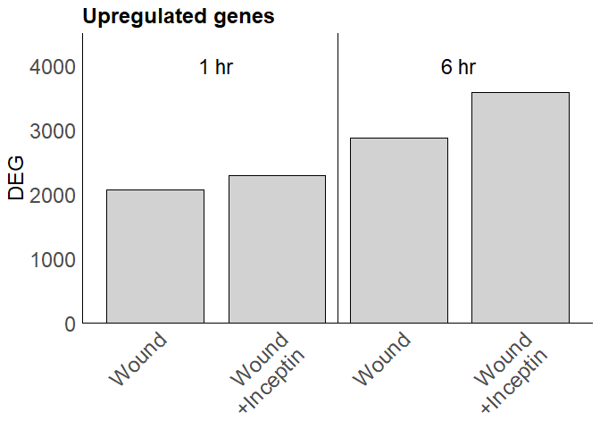<!-- -->

``` r
hist5 <- deseq_input %>% filter(comp=="H1U1" & class==-1)
hist6 <- deseq_input %>% filter(comp=="I1U1" & class==-1)
hist7 <- deseq_input %>% filter(comp=="H6U1" & class==-1)
hist8 <- deseq_input %>% filter(comp=="I6U1" & class==-1)

histogram2 <- data.frame("DEG"= c(nrow(hist5),nrow(hist6),nrow(hist7),nrow(hist8)))
histogram2 <- cbind(histogram2,column=(c("1","2","3","4")))
histogram_gg2 <- ggplot(data=histogram2,aes(column,DEG)) +
  theme_minimal() +
    scale_x_discrete(labels=c("1" = "Wound", "2" = "Wound\n+Inceptin",
                              "3" = "Wound", "4" = "Wound\n+Inceptin")) +
    test_theme +
    #theme(axis.text.x.top = element_text(vjust = 0.5))+
    geom_col(width=0.8,fill=color7,color="black",alpha=0.7) +
    scale_y_continuous(limits=c(0, 4500), expand = c(0, 0)) +
  theme(legend.position = "none",
       panel.grid.major = element_blank(), 
       panel.grid.minor = element_blank(),
       panel.background = element_blank(), 
       axis.line = element_line(colour = "black"),
       axis.title.x=element_blank()) +
  annotate("text", size=6,x = c(1.5,3.5), y = c(4000,4000), label = c("1 hr", "6 hr")) +
  annotate("segment", x = 2.5,xend=2.5, y=0, yend=4500, size=0.25) +
  ggtitle("Downregulated genes")
histogram_gg2
```

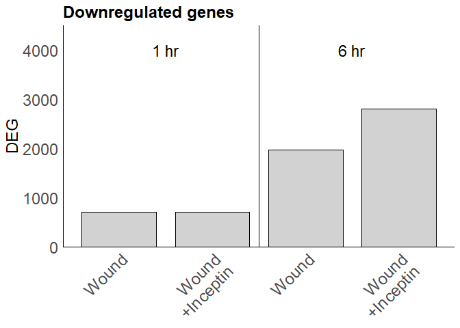<!-- -->

``` r
ggsave("boxplots/Fig1B_DEGs.png",plot_grid(histogram_gg2,histogram_gg),height=5,width=8)

listH1 <- c(hist1$gene)
listI1 <- c(hist2$gene)
listH6 <- c(hist3$gene)
listI6 <- c(hist4$gene)
neglistH1 <- c(hist5$gene)
neglistI1 <- c(hist6$gene)
neglistH6 <- c(hist7$gene)
neglistI6 <- c(hist8$gene)
```

### These scripts demonstrate the use of dplyr to merge lists of genes based on matching criteria

#### In this example we are looking for genes which are wound-downregulated (class -1) at 6 hr (H6U1) and upregulated (class 1) at 6 hr

``` r
numcomp <- 2
#only keep if gene occurs in two separate comparisons; 

comp1 <- "H1U1"
comp2 <- "H6U1"
set <- deseq_input %>%
  filter((comp==comp1 & class==-1) | (comp==comp2 & class==1)) %>%
  group_by(gene) %>%
  filter(n()==numcomp) 
#Merge the list into a single list of genes using intersect
list <- intersect(c(set$gene),c(set$gene))

list
```

    ##  [1] "Vigun01g054800" "Vigun01g062400" "Vigun01g068100" "Vigun01g116700"
    ##  [5] "Vigun01g178900" "Vigun01g196800" "Vigun01g205700" "Vigun01g219500"
    ##  [9] "Vigun01g232100" "Vigun02g004500" "Vigun02g005800" "Vigun02g040100"
    ## [13] "Vigun02g041200" "Vigun02g058900" "Vigun02g061700" "Vigun02g062300"
    ## [17] "Vigun03g006700" "Vigun03g043800" "Vigun03g050900" "Vigun03g064300"
    ## [21] "Vigun03g068200" "Vigun03g085700" "Vigun03g096600" "Vigun03g148400"
    ## [25] "Vigun03g211200" "Vigun03g252000" "Vigun03g316000" "Vigun03g337300"
    ## [29] "Vigun03g341800" "Vigun03g377000" "Vigun03g401100" "Vigun03g412500"
    ## [33] "Vigun03g415900" "Vigun03g426900" "Vigun04g051400" "Vigun04g100200"
    ## [37] "Vigun04g111500" "Vigun04g146600" "Vigun04g148400" "Vigun04g148600"
    ## [41] "Vigun04g195400" "Vigun05g017000" "Vigun05g031400" "Vigun05g119000"
    ## [45] "Vigun05g194800" "Vigun05g226900" "Vigun05g275800" "Vigun05g289400"
    ## [49] "Vigun06g071300" "Vigun06g072300" "Vigun06g074300" "Vigun06g097500"
    ## [53] "Vigun06g113300" "Vigun06g198400" "Vigun06g219500" "Vigun07g057900"
    ## [57] "Vigun07g076200" "Vigun07g080900" "Vigun07g104400" "Vigun07g138400"
    ## [61] "Vigun07g154600" "Vigun07g290200" "Vigun08g034300" "Vigun08g117200"
    ## [65] "Vigun08g132200" "Vigun08g160200" "Vigun08g176300" "Vigun08g196000"
    ## [69] "Vigun09g017200" "Vigun09g038700" "Vigun09g058800" "Vigun09g074300"
    ## [73] "Vigun09g097400" "Vigun09g116800" "Vigun09g132300" "Vigun09g213100"
    ## [77] "Vigun09g244900" "Vigun09g264800" "Vigun09g265600" "Vigun10g111200"
    ## [81] "Vigun10g124600" "Vigun10g152500" "Vigun11g025300" "Vigun11g096800"
    ## [85] "Vigun11g097600" "Vigun11g097800" "Vigun11g110200" "Vigun11g162800"
    ## [89] "Vigun11g192800"

### Generate lists to generate boxplots

``` r
#1 hour

#wound down but inceptin up
numcomp <- 2
contrastset1 <-deseq_input %>%
  filter((comp=="I1H1" & class==1) | (comp=="H1U1" & class==-1)) %>%
  group_by(gene) %>%
  filter(n()==numcomp)
contrastset1 <- intersect(c(contrastset1$gene),c(contrastset1$gene))

##inceptin-up or wound up
numcomp <- 3
comp1 <- "I1U1"
comp2 <- "I1H1"
comp3 <- "H1U1"
set0 <- deseq_input %>%
  filter((comp==comp1 & class==1) | (comp==comp2 & class==1) | (comp==comp3 & class==1)) %>%
  group_by(gene)
list0 <- intersect(c(set0$gene),c(set0$gene))

#just inceptin up
numcomp <- 1
comp1 <- "I1H1"
set0_1 <- deseq_input %>%
  filter((comp==comp1 & class==1)) %>%
  group_by(gene)
list0_1 <- intersect(c(set0_1$gene),c(set0_1$gene))


##inceptin-amplified
###dmg up and inc up
numcomp <- 2
comp1 <- "H1U1"
comp2 <- "I1H1"
set1 <- deseq_input %>%
  filter((comp==comp1 & class==1) | (comp==comp2 & class==1)) %>%
  group_by(gene) %>%
  filter(n()==numcomp) #only keep if gene occurs twice e.g. not sig at either 1 hr or 6 hr
list1 <- intersect(c(set1$gene),c(set1$gene))

##inceptin-specific
numcomp <- 3
comp1 <- "H1U1"
comp2 <- "H6U1"
comp3 <- "I1H1"
set2 <- deseq_input %>%
  filter((comp==comp1 & class!=1) | (comp==comp2 & class!=1) | (comp==comp3 & class==1)) %>%
  group_by(gene) %>%
  filter(n()==numcomp) #only keep if gene occurs twice e.g. not sig at either 1 hr or 6 hr
list2 <- intersect(c(set2$gene),c(set2$gene))

##inceptin-specific
numcomp <- 3
comp1 <- "H1U1"
comp2 <- "H6U1"
comp3 <- "I1H1"
set2_rrf <- deseq_input %>%
  filter((comp==comp1 & class!=1) | (comp==comp2) | (comp==comp3 & class==1)) %>%
  group_by(gene) %>%
  filter(n()==numcomp) #only keep if gene occurs twice e.g. not sig at either 1 hr or 6 hr
list2_rrf <- intersect(c(set2$gene),c(set2$gene))

##inceptin-accelerated
numcomp <- 3
comp1 <- "H6U1"
comp2 <- "H1U1"
comp3 <- "I1H1"
set3 <- deseq_input %>%
  filter((comp==comp1 & class==1) | (comp==comp2 & class!=1) | (comp==comp3 & class==1)) %>%
  group_by(gene) %>%
  filter(n()==numcomp) #only keep if gene occurs twice e.g. not sig at either 1 hr or 6 hr
list3 <- intersect(c(set3$gene),c(set3$gene))

##inceptin-reversed
numcomp <- 2
comp1 <- "H1U1"
comp2 <- "I1H1"
set33 <- deseq_input %>%
  filter((comp==comp1 & class==-1) | (comp==comp2 & class==1) | (comp==comp3 & class==1)) %>%
  group_by(gene) %>%
  filter(n()==numcomp) #only keep if gene occurs twice e.g. not sig at either 1 hr or 6 hr
list33 <- intersect(c(set33$gene),c(set33$gene))

#non duplicated overlaps
onehr <- list0_1 %>% union(list1) %>% union(list2) %>% union(list3)

comp_list <- c("H1U1","I1U1","H6U1","I6U1")
onehrData <- deseq_input %>% filter(gene %in% onehr& comp %in% comp_list)
amplify1 <- deseq_input %>% filter(gene %in% onehr& comp %in% comp_list) %>% 
  mutate(color=case_when(gene %in% list1 ~ "amplified"),log2=case_when(gene %in% list1 ~ log2FoldChange))%>% filter(color=="amplified")
specific1 <- deseq_input %>% filter(gene %in% onehr& comp %in% comp_list) %>% 
  mutate(color=case_when(gene %in% list2 ~ "specific"),log2=case_when(gene %in% list2 ~ log2FoldChange)) %>% filter(color=="specific")
accelerate1 <- deseq_input %>% filter(gene %in% onehr& comp %in% comp_list) %>% 
  mutate(color=case_when(gene %in% list3 ~ "accelerate"),log2=case_when(gene %in% list3 ~ log2FoldChange))%>% filter(color=="accelerate") 
specific1_rrf <- deseq_input %>% filter(comp %in% comp_list) %>% 
  mutate(color=case_when(gene %in% list2_rrf ~ "specific"),log2=case_when(gene %in% list2 ~ log2FoldChange)) %>% filter(color=="specific")

reversed1 <- deseq_input %>% filter(gene %in% onehr& comp %in% comp_list) %>% mutate(color=case_when(gene %in% list33 ~ "reversed"),log2=case_when(gene %in% list33 ~ log2FoldChange))%>% filter(color=="reversed")
```

### Generate Figs. 2A-C, 1 hr plots

``` r
comp_list <- c("H1U1","I1U1")
panel_a <- ggplot(amplify1) + aes(y=log2,x=comp) + 
  geom_hline(yintercept = 0) +
  #geom_point(cex=0.5,pch=16)
  geom_boxplot(fill=color1,alpha=0.7) + 
  #geom_jitter(aes(y=log2,x=comp,col=color)) + 
  scale_x_discrete(limits=c(comp_list),labels=c("H1U1" = "W", "I1U1" = "W + In")) + 
  boxplot_theme + 
  scale_color_manual(values = c(color4)) + scale_y_continuous(breaks=seq(-4,11,2),limit=ylim) + labs(y="log2(FC) vs undamaged",title=paste(length(list1),"In-Amplified")) #+ 
   #stat_summary(fun.data = give.n,geom = "text")

  
comp_list <- c("H1U1","I1U1","H6U1","I6U1")
panel_c <- ggplot(accelerate1) + aes(y=log2,x=comp) + 
  geom_hline(yintercept = 0) +
  geom_vline(xintercept=2.5) +
  geom_boxplot(fill=c(color3,color3,color7,color7),alpha=0.7) + 
  scale_x_discrete(limits=c(comp_list),labels=c("H1U1" = "W", "I1U1" = "W + In", "H6U1" = "W", "I6U1" = "W + In")) + 
  boxplot_theme + 
  scale_color_manual(values = c(color6))  + scale_y_continuous(breaks=seq(-4,11,2),limit=ylim) +
  annotate("text", size=5,x = c(1.5,3.5), y = c(10,10), label = c("1 hr", "6 hr")) +
  geom_vline(xintercept=2.5) +
  labs(y="log2(FC) vs undamaged",title=paste(length(list3),"In-Accelerated"))

comp_list <- c("H1U1","I1U1")
panel_b <- ggplot(specific1) + aes(y=log2,x=comp) + 
  geom_hline(yintercept = 0) +
  geom_boxplot(fill=color2,alpha=0.7) + 
  scale_x_discrete(limits=c(comp_list),labels=c("H1U1" = "W", "I1U1" = "W + In")) + 
  boxplot_theme + 
  scale_color_manual(values = c(color5))  + scale_y_continuous(breaks=seq(-4,11,2),limit=ylim) +
  labs(y="log2(FC) vs undamaged",title=paste(length(list2),"In-Specific"))


# preview plots
plot_grid(panel_a,panel_b,panel_c)
```

    ## Warning: Removed 386 rows containing missing values (stat_boxplot).

    ## Warning: Removed 198 rows containing missing values (stat_boxplot).

    ## Warning: Removed 1 rows containing non-finite values (stat_boxplot).

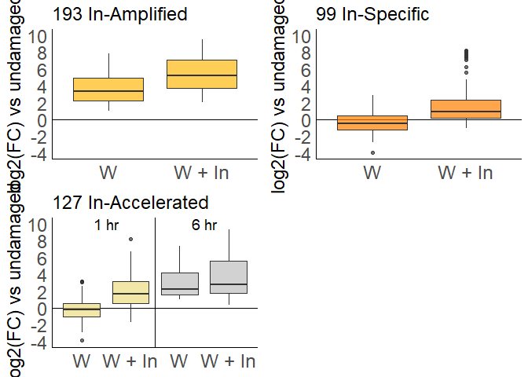<!-- -->

#### 6 hr lists

``` r
#6 hour

#wound down but inceptin up
numcomp <- 2
contrastset6 <-deseq_input %>%
  filter((comp=="I6H6" & class==1) | (comp=="H6U1" & class==-1)) %>%
  group_by(gene) %>%
  filter(n()==numcomp)
contrastset6 <- intersect(c(contrastset6$gene),c(contrastset6$gene))


#inceptin up or wound up
numcomp <- 3
comp1 <- "I6U1"
comp2 <- "I6H6"
comp3 <- "H6U1"
set35 <- deseq_input %>%
  filter((comp==comp1 & class==1) | (comp==comp2 & class==1) | (comp==comp3 & class==1)) %>%
  group_by(gene)
list35 <- intersect(c(set35$gene),c(set35$gene))

#just inceptin up
numcomp <- 2
comp1 <- "I6H6"
set35_1 <- deseq_input %>%
  filter((comp==comp1 & class==1)) %>%
  group_by(gene)
list35_1 <- intersect(c(set35_1$gene),c(set35_1$gene))

##inceptin-amplified
###dmg up and inc up
numcomp <- 2
comp1 <- "H6U1"
comp2 <- "I6H6"
set4 <- deseq_input %>%
  filter((comp==comp1 & class==1) | (comp==comp2 & class==1)) %>%
  group_by(gene) %>%
  filter(n()==numcomp) #only keep if gene occurs twice e.g. not sig at either 1 hr or 6 hr
list4 <- intersect(c(set4$gene),c(set4$gene))

##inceptin-specific
numcomp <- 3
comp1 <- "H1U1"
comp2 <- "H6U1"
comp3 <- "I6H6"
set5 <- deseq_input %>%
  filter((comp==comp1 & class!=1) | (comp==comp2 & class!=1) | (comp==comp3 & class==1)) %>%
  group_by(gene) %>%
  filter(n()==numcomp) #only keep if gene occurs twice e.g. not sig at either 1 hr or 6 hr
list5 <- intersect(c(set5$gene),c(set5$gene))


##inceptin-prolonged
numcomp <- 3
comp1 <- "H1U1"
comp2 <- "H6U1"
comp3 <- "I6H6"
set6 <- deseq_input %>%
  filter((comp==comp1 & class==1) | (comp==comp2 & class!=1) | (comp==comp3 & class==1)) %>%
  group_by(gene) %>%
  filter(n()==numcomp) #only keep if gene occurs twice e.g. not sig at either 1 hr or 6 hr
list6 <- intersect(c(set6$gene),c(set6$gene))

#non duplicated overlaps
sixhr <- union(union(list4,list5),list6)
amplify_accelerate <- intersect(list4,list6)

##inceptin-reversed
numcomp <- 2
comp1 <- "H6U1"
comp2 <- "I6H6"
set7 <- deseq_input %>%
  filter((comp==comp1 & class==-1) | (comp==comp2 & class==1) | (comp==comp3 & class==1)) %>%
  group_by(gene) %>%
  filter(n()==numcomp) #only keep if gene occurs twice e.g. not sig at either 1 hr or 6 hr
list7 <- intersect(c(set7$gene),c(set7$gene))

comp_list <- c("H1U1","I1U1","H6U1","I6U1")
reversed6 <- deseq_input %>% filter(gene %in% list35_1 & comp %in% comp_list) %>% mutate(color=case_when(gene %in% list7 ~ "reversed"),log2=case_when(gene %in% list7 ~ log2FoldChange))%>% filter(color=="reversed")
```

### Figs. 2E-G, 6 hr plots

``` r
comp_list <- c("H1U1","I1U1","H6U1","I6U1")
amplify6 <- deseq_input %>% filter(gene %in% sixhr& comp %in% comp_list) %>% 
  mutate(color=case_when(gene %in% list4 ~ "amplified"),log2=case_when(gene %in% list4 ~ log2FoldChange))
specific6 <- deseq_input %>% filter(gene %in% sixhr& comp %in% comp_list) %>% 
  mutate(color=case_when(gene %in% list5 ~ "specific"),log2=case_when(gene %in% list5 ~ log2FoldChange))
prolong6 <- deseq_input %>% filter(gene %in% sixhr& comp %in% comp_list) %>% 
  mutate(color=case_when(gene %in% list6 ~ "accelerate"),log2=case_when(gene %in% list6 ~ log2FoldChange))


comp_list <- c("H6U1","I6U1")
panel_e <- ggplot(amplify6) + aes(y=log2,x=comp) + 
  geom_hline(yintercept = 0) +
  geom_boxplot(fill=color4,alpha=0.7) + 
  scale_x_discrete(limits=c(comp_list),labels=c("H6U1" = "W", "I6U1" = "W + In")) + 
  boxplot_theme + 
  scale_color_manual(values = c("red1")) + scale_y_continuous(breaks=seq(-4,11,2),limit=ylim) + labs(y="log2(FC) vs undamaged",title=paste(length(list4),"In-Amplified"))

comp_list <- c("H1U1","I1U1","H6U1","I6U1")
panel_g <- ggplot(prolong6) + aes(y=log2,x=comp) + 
  geom_hline(yintercept = 0) +
    geom_vline(xintercept=2.5) +
  geom_boxplot(fill=c(color7,color7,color6,color6),alpha=0.7) + 
  scale_x_discrete(limits=c(comp_list),labels=c("H1U1" = "W", "I1U1" = "W + In", "H6U1" = "W", "I6U1" = "W + In")) + 
  boxplot_theme + 
  scale_color_manual(values = c("red3"))  + scale_y_continuous(breaks=seq(-4,11,2),limit=ylim) + annotate("text", size=5,x = c(1.5,3.5), y = c(10,10), label = c("1 hr", "6 hr")) + labs(y="log2(FC) vs undamaged",title=paste(length(list6),"In-Prolonged"))

comp_list <- c("H6U1","I6U1")
panel_f <- ggplot(specific6) + aes(y=log2,x=comp) + 
  geom_hline(yintercept = 0) +
  geom_boxplot(fill=color5,alpha=0.7) + 
  scale_x_discrete(limits=c(comp_list)) + 
  scale_x_discrete(limits=c(comp_list),labels=c("H6U1" = "W", "I6U1" = "W + In")) + 
  boxplot_theme + 
  scale_color_manual(values = c("red2"))  + scale_y_continuous(breaks=seq(-4,11,2),limit=ylim) + labs(y="log2(FC) vs undamaged",title=paste(length(list5),"In-Specific"))
```

    ## Scale for 'x' is already present. Adding another scale for 'x', which will
    ## replace the existing scale.

``` r
plot_grid(panel_e,panel_f,panel_g)
```

    ## Warning: Removed 1084 rows containing missing values (stat_boxplot).

    ## Warning: Removed 594 rows containing non-finite values (stat_boxplot).

    ## Warning: Removed 1084 rows containing missing values (stat_boxplot).

    ## Warning: Removed 681 rows containing non-finite values (stat_boxplot).

    ## Warning: Removed 1788 rows containing non-finite values (stat_boxplot).

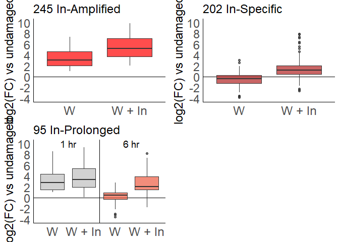<!-- -->

### summary stats

``` r
filter(deseq_input, gene %in% list0_1) %>% group_by(comp) %>% summarize(median=median(log2FoldChange),n=n())
```

    ## # A tibble: 8 x 3
    ##   comp  median     n
    ##   <chr>  <dbl> <int>
    ## 1 H1U1   1.16    419
    ## 2 H6H1   0.529   419
    ## 3 H6U1   1.72    419
    ## 4 I1H1   1.67    419
    ## 5 I1U1   3.20    419
    ## 6 I6H6   0.534   419
    ## 7 I6I1  -0.444   419
    ## 8 I6U1   2.50    419

``` r
filter(deseq_input, gene %in% list1) %>% group_by(comp) %>% summarize(median=median(log2FoldChange),n=n())
```

    ## # A tibble: 8 x 3
    ##   comp  median     n
    ##   <chr>  <dbl> <int>
    ## 1 H1U1   3.39    193
    ## 2 H6H1  -0.985   193
    ## 3 H6U1   2.23    193
    ## 4 I1H1   1.59    193
    ## 5 I1U1   5.19    193
    ## 6 I6H6   0.662   193
    ## 7 I6I1  -2.09    193
    ## 8 I6U1   3.15    193

``` r
filter(deseq_input, gene %in% list2) %>% group_by(comp) %>% summarize(median=median(log2FoldChange),n=n())
```

    ## # A tibble: 8 x 3
    ##   comp  median     n
    ##   <chr>  <dbl> <int>
    ## 1 H1U1  -0.453    99
    ## 2 H6H1   0.405    99
    ## 3 H6U1   0.223    99
    ## 4 I1H1   1.56     99
    ## 5 I1U1   0.956    99
    ## 6 I6H6   0.331    99
    ## 7 I6I1  -0.677    99
    ## 8 I6U1   0.604    99

``` r
filter(deseq_input, gene %in% list3) %>% group_by(comp) %>% summarize(median=median(log2FoldChange),n=n())
```

    ## # A tibble: 8 x 3
    ##   comp  median     n
    ##   <chr>  <dbl> <int>
    ## 1 H1U1  -0.301   127
    ## 2 H6H1   2.95    127
    ## 3 H6U1   2.25    127
    ## 4 I1H1   2.01    127
    ## 5 I1U1   1.67    127
    ## 6 I6H6   0.460   127
    ## 7 I6I1   1.34    127
    ## 8 I6U1   2.80    127

``` r
filter(deseq_input, gene %in% list35_1) %>% group_by(comp) %>% summarize(median=median(log2FoldChange),n=n())
```

    ## # A tibble: 8 x 3
    ##   comp  median     n
    ##   <chr>  <dbl> <int>
    ## 1 H1U1   1.04    542
    ## 2 H6H1  -0.308   542
    ## 3 H6U1   1.08    542
    ## 4 I1H1   0.474   542
    ## 5 I1U1   1.71    542
    ## 6 I6H6   1.60    542
    ## 7 I6I1   1.00    542
    ## 8 I6U1   3.05    542

``` r
filter(deseq_input, gene %in% list4) %>% group_by(comp) %>% summarize(median=median(log2FoldChange),n=n())
```

    ## # A tibble: 8 x 3
    ##   comp  median     n
    ##   <chr>  <dbl> <int>
    ## 1 H1U1   1.80    245
    ## 2 H6H1   1.14    245
    ## 3 H6U1   3.09    245
    ## 4 I1H1   0.890   245
    ## 5 I1U1   2.96    245
    ## 6 I6H6   1.64    245
    ## 7 I6I1   2.33    245
    ## 8 I6U1   5.22    245

``` r
filter(deseq_input, gene %in% list5) %>% group_by(comp) %>% summarize(median=median(log2FoldChange),n=n())
```

    ## # A tibble: 8 x 3
    ##   comp   median     n
    ##   <chr>   <dbl> <int>
    ## 1 H1U1  -0.0154   202
    ## 2 H6H1  -0.500    202
    ## 3 H6U1  -0.395    202
    ## 4 I1H1   0.0326   202
    ## 5 I1U1  -0.0414   202
    ## 6 I6H6   1.50     202
    ## 7 I6I1   1.01     202
    ## 8 I6U1   1.25     202

``` r
filter(deseq_input, gene %in% list6) %>% group_by(comp) %>% summarize(median=median(log2FoldChange),n=n())
```

    ## # A tibble: 8 x 3
    ##   comp  median     n
    ##   <chr>  <dbl> <int>
    ## 1 H1U1   2.85     95
    ## 2 H6H1  -2.61     95
    ## 3 H6U1   0.467    95
    ## 4 I1H1   0.472    95
    ## 5 I1U1   3.37     95
    ## 6 I6H6   1.86     95
    ## 7 I6I1  -0.974    95
    ## 8 I6U1   2.08     95

### recreate log2FC

``` r
H1U1 <- select(filter(deseq_input,comp=="H1U1"),gene,baseMean,log2FoldChange)
names(H1U1)[3]<-"H1U1_log2FC"
I1U1 <- select(filter(deseq_input,comp=="I1U1"),gene,log2FoldChange)
names(I1U1)[2]<-"I1U1_log2FC"
I1H1 <- select(filter(deseq_input,comp=="I1H1"),gene,log2FoldChange)
names(I1H1)[2]<-"I1H1_log2FC"
H6U1 <- select(filter(deseq_input,comp=="H6U1"),gene,log2FoldChange)
names(H6U1)[2]<-"H6U1_log2FC"
I6U1 <- select(filter(deseq_input,comp=="I6U1"),gene,log2FoldChange)
names(I6U1)[2]<-"I6U1_log2FC"
I6H6 <- select(filter(deseq_input,comp=="I6H6"),gene,log2FoldChange)
names(I6H6)[2]<-"I6H6_log2FC"
FCs <- H1U1 %>% left_join(I1U1,by="gene") %>% left_join(I1H1,by="gene") %>% left_join(H6U1,by="gene") %>% left_join(I6U1,by="gene") %>% left_join(I6H6,by="gene")
```

\#write lists

``` r
contrastdf1 <- data.frame(contrastset1)
names(contrastdf1)[1]<-"gene"
contrastdf1 <- contrastdf1 %>% left_join(annotations) %>% left_join(FCs)
```

    ## Joining, by = "gene"
    ## Joining, by = "gene"

``` r
contrastdf6 <- data.frame(contrastset6)
names(contrastdf6)[1]<-"gene"
contrastdf6 <- contrastdf6 %>% left_join(annotations) %>% left_join(FCs)
```

    ## Joining, by = "gene"
    ## Joining, by = "gene"

``` r
write_csv(contrastdf1, "boxplots/contrastlist1hr.csv",na="")  
write_csv(contrastdf6, "boxplots/contrastlist6hr.csv",na="")  

df_H1 <- data.frame(listH1,"*")
names(df_H1)[1]<-"gene"
names(df_H1)[2]<-"onehr_dmg"
df_0 <- data.frame(list0_1)
names(df_0)[1]<-"gene"
df_1 <- data.frame(list1,"1 hr In-amplified")
names(df_1)[1]<-"gene"
names(df_1)[2]<-"in_1_subset"
df_2 <- data.frame(list2,"1 hr In-specific")
names(df_2)[1]<-"gene"
names(df_2)[2]<-"in_1_subset"
df_3 <- data.frame(list3,"1 hr In-accelerated")
names(df_3)[1]<-"gene"
names(df_3)[2]<-"in_1_subset"

submerge1hr <- full_join(df_0,full_join(df_1,full_join(df_2,df_3))) %>% replace(., is.na(.), "1 hr In-induced")
```

    ## Joining, by = c("gene", "in_1_subset")

    ## Joining, by = c("gene", "in_1_subset")

    ## Joining, by = "gene"

``` r
merge1hr <- full_join(df_H1,submerge1hr) %>% left_join(annotations) %>% left_join(FCs)
```

    ## Joining, by = "gene"
    ## Joining, by = "gene"
    ## Joining, by = "gene"

``` r
df_H6 <- data.frame(listH6,"*")
names(df_H6)[1]<-"gene"
names(df_H6)[2]<-"sixhr_dmg"
df_35 <- data.frame(list35_1)
names(df_35)[1]<-"gene"
df_4 <- data.frame(list4,"6 hr In-amplified")
names(df_4)[1]<-"gene"
names(df_4)[2]<-"in_6_subset"
df_5 <- data.frame(list5,"6 hr In-specific")
names(df_5)[1]<-"gene"
names(df_5)[2]<-"in_6_subset"
df_6 <- data.frame(list6,"6 hr In-prolonged")
names(df_6)[1]<-"gene"
names(df_6)[2]<-"in_6_subset"

submerge6hr <- full_join(df_35,full_join(df_4,full_join(df_5,df_6))) %>% replace(., is.na(.), "6 hr In-induced")
```

    ## Joining, by = c("gene", "in_6_subset")

    ## Joining, by = c("gene", "in_6_subset")

    ## Joining, by = "gene"

``` r
merge6hr <- full_join(df_H6,submerge6hr) %>% left_join(annotations) %>% left_join(FCs)
```

    ## Joining, by = "gene"
    ## Joining, by = "gene"
    ## Joining, by = "gene"

``` r
write_csv(merge6hr, "boxplots/6hr_list.csv",na="")  
write_csv(merge1hr, "boxplots/1hr_list.csv",na="")  

merge <- full_join(merge6hr,merge1hr)
```

    ## Joining, by = c("gene", "arabi-defline", "baseMean", "H1U1_log2FC", "I1U1_log2FC", "I1H1_log2FC", "H6U1_log2FC", "I6U1_log2FC", "I6H6_log2FC")

``` r
merge <- merge %>% left_join(annotations) %>% left_join(FCs)
```

    ## Joining, by = c("gene", "arabi-defline")

    ## Joining, by = c("gene", "baseMean", "H1U1_log2FC", "I1U1_log2FC", "I1H1_log2FC", "H6U1_log2FC", "I6U1_log2FC", "I6H6_log2FC")

``` r
write_csv(merge,"boxplots/lists.csv",na="")
```

### Fig. 1B euler diagrams

``` r
#ALL genes in the special categories at 1 hr
overlap_all <- intersect(list0_1,list35_1)
amplified_overlap <- intersect(list1,list4)
prolong_accel_overlap <- intersect(list3,list6)
specific_overlap <- intersect(list2,list5)
length(overlap_all)
```

    ## [1] 98

``` r
euler_data_up <- euler(c("1hr"=length(list0_1)-length(overlap_all),"6hr"=length(list35_1)-length(overlap_all),"1hr&6hr"=length(overlap_all)))
venn_up <- plot(euler_data_up,
     fills = c(color0,color35),
     #edges = FALSE,
     fontsize = 16,
     quantities = list(fontsize = 16))

ggsave("boxplots/venn_up.png",venn_up,width=4,height=3)
```

### Figs. 1D, 1H: Create count vs count plots for panels D and G

``` r
#plotting raw counts data: creates a color column depending on which categories it's in
counts1 <- mutate(counts, color=
                    ifelse(gene %in% list1, "B amplified", 
                           ifelse(gene %in% list2, "C specific", 
                                  ifelse(gene %in% list3, "D accelerated","other")
                                  )
                           )
                  )
counts1 <- mutate(counts1,trans=ifelse(color=="other",0,1)) %>% 
  arrange(trans)
counts6 <- mutate(counts, color=
                    ifelse(gene %in% list4, "G amplified", 
                           ifelse(gene %in% list5, "H specific", 
                                  ifelse(gene %in% list6, "I prolonged","other")
                                  )
                           )
                  )
#counts6 <- mutate(counts, color=
#                    ifelse(gene %in% amplify_accelerate, "blue", 
#                           ifelse(gene %in% threehr, "red", 
#                                  ifelse(gene %in% list6, "green","black")
#                                  )
#                           )
#                  )
counts6 <- mutate(counts6,trans=ifelse(color=="other",0,1)) %>% 
  arrange(trans)

counts <- mutate(counts, 
                 onehr_in_up=ifelse(gene %in% submerge1hr$gene,"darkgoldenrod1","gray50"),
                 sixhr_in_up=ifelse(gene %in% submerge6hr$gene,"red1","gray50"),
                 onehr_dmg_up=ifelse(gene %in% listH1,"black","gray50"),
                 sixhr_dmg_up=ifelse(gene %in% listH6,"black","gray50"),
                  onehr_in_up_font=ifelse(gene %in% submerge1hr$gene | gene %in% listI1,"bold","plain"),
                 sixhr_in_up_font=ifelse(gene %in% submerge6hr$gene | gene %in% listI6,"bold","plain"),
                 onehr_dmg_up_font=ifelse(gene %in% listH1,"bold","plain"),
                 sixhr_dmg_up_font=ifelse(gene %in% listH6,"bold","plain"),
                 )

panel_d <- ggplot(counts1) + boxplot_theme + aes(y=I1,x=H1,col=color,alpha=trans) + geom_point() + ylab(paste("log2(counts)","\n", "W + In 1 hr")) + xlab("log2(counts), Wound 1 hr") + ylim(c(-4,15)) + xlim(c(-4,15)) +  geom_abline(intercept = 0, slope = 1) + scale_color_manual(values = c(color1,color2,color3,color7))

panel_h <- ggplot(counts6) + boxplot_theme + aes(y=I6,x=H6,col=color,alpha=trans) + geom_point() + ylab(paste("log2(counts)","\n", "W + In 6 hr")) + xlab("log2(counts), Wound 6 hr") + ylim(c(-4,15)) + xlim(c(-4,15)) +  geom_abline(intercept = 0, slope = 1)  + scale_color_manual(values = c(color4,color5,color6,color7))

figure_up_new_row1 <- plot_grid(panel_a,panel_b,panel_c,panel_d,labels=c("A","B","C","D"),ncol=4,rel_widths=c(11,11,18,15.8),label_size=boxplot_font_size)
```

    ## Warning: Removed 386 rows containing missing values (stat_boxplot).

    ## Warning: Removed 198 rows containing missing values (stat_boxplot).

    ## Warning: Removed 1 rows containing non-finite values (stat_boxplot).

    ## Warning: Removed 14 rows containing missing values (geom_point).

``` r
ggsave("boxplots/fig1_new_row1.png",figure_up_new_row1,width=15,height=3.75,)

figure_up_new_row2 <- plot_grid(panel_e,panel_f,panel_g,panel_h,labels=c("E","F","G","H"),ncol=4,rel_widths=c(11,11,18,15.8),label_size=boxplot_font_size)
```

    ## Warning: Removed 1084 rows containing missing values (stat_boxplot).

    ## Warning: Removed 594 rows containing non-finite values (stat_boxplot).

    ## Warning: Removed 1084 rows containing missing values (stat_boxplot).

    ## Warning: Removed 681 rows containing non-finite values (stat_boxplot).

    ## Warning: Removed 1788 rows containing non-finite values (stat_boxplot).

    ## Warning: Removed 7 rows containing missing values (geom_point).

``` r
ggsave("boxplots/fig1_new_row2.png",figure_up_new_row2,width=15,height=3.75)
```

### generate all FC for heatmaps; filter out non sig

``` r
H1U1 <- select(filter(deseq_input,comp=="H1U1" & sig==1),gene,baseMean,log2FoldChange)
names(H1U1)[3]<-"H1U1_log2FC"
I1U1 <- select(filter(deseq_input,comp=="I1U1" & sig==1),gene,log2FoldChange)
names(I1U1)[2]<-"I1U1_log2FC"
I1H1 <- select(filter(deseq_input,comp=="I1H1" & sig==1),gene,log2FoldChange)
names(I1H1)[2]<-"I1H1_log2FC"
H6U1 <- select(filter(deseq_input,comp=="H6U1" & sig==1),gene,log2FoldChange)
names(H6U1)[2]<-"H6U1_log2FC"
I6U1 <- select(filter(deseq_input,comp=="I6U1" & sig==1),gene,log2FoldChange)
names(I6U1)[2]<-"I6U1_log2FC"
I6H6 <- select(filter(deseq_input,comp=="I6H6" & sig==1),gene,log2FoldChange)
names(I6H6)[2]<-"I6H6_log2FC"
FCs_sig <- H1U1 %>% full_join(I1U1,by="gene") %>% full_join(I1H1,by="gene") %>% full_join(H6U1,by="gene") %>% full_join(I6U1,by="gene") %>% full_join(I6H6,by="gene")

FCtable <- left_join(annotations,FCs_sig)
```

    ## Joining, by = "gene"

``` r
write.table(FCtable, "boxplots/cowpeaFClist.txt",na="",sep="\t",col.names=NA)
```

### Reset colors and ylimfor negative lists

``` r
negcolor0<-"lightblue"
negcolor1<-"paleturquoise1" #amp
negcolor2<-"skyblue" #specific
negcolor3<-"steelblue1" #accel
negcolor35<-"lightslateblue"
negcolor4<-"mediumpurple1" #amp
negcolor5<-"slateblue1" #specific
negcolor6<-"darkorchid1" #prolong
negcolor7<-"grey"

ylim<-c(-10,4)
```

#### Fig. S4: Re-generate negative lists

``` r
#1 hour

#wound up but inceptin down
numcomp <- 2
contrastset1 <-deseq_input %>%
  filter((comp=="I1H1" & class==-1) | (comp=="H1U1" & class==1)) %>%
  group_by(gene) %>%
  filter(n()==numcomp)
contrastset1 <- intersect(c(contrastset1$gene),c(contrastset1$gene))

##inceptin-up or wound up
numcomp <- 3
comp1 <- "I1U1"
comp2 <- "I1H1"
comp3 <- "H1U1"
set0 <- deseq_input %>%
  filter((comp==comp1 & class==-1) | (comp==comp2 & class==-1) | (comp==comp3 & class==-1)) %>%
  group_by(gene)
list0 <- intersect(c(set0$gene),c(set0$gene))

#just inceptin up
numcomp <- 1
comp1 <- "I1H1"
set0_1 <- deseq_input %>%
  filter((comp==comp1 & class==-1)) %>%
  group_by(gene)
list0_1 <- intersect(c(set0_1$gene),c(set0_1$gene))
neglist0_1 <- list0_1

##inceptin-amplified
###dmg up and inc up
numcomp <- 2
comp1 <- "H1U1"
comp2 <- "I1H1"
set1 <- deseq_input %>%
  filter((comp==comp1 & class==-1) | (comp==comp2 & class==-1)) %>%
  group_by(gene) %>%
  filter(n()==numcomp) #only keep if gene occurs twice e.g. not sig at either 1 hr or 6 hr
list1 <- intersect(c(set1$gene),c(set1$gene))
neglist1 <- list1

##inceptin-specific
numcomp <- 3
comp1 <- "H1U1"
comp2 <- "H6U1"
comp3 <- "I1H1"
set2 <- deseq_input %>%
  filter((comp==comp1 & class!=-1) | (comp==comp2 & class!=-1) | (comp==comp3 & class==-1)) %>%
  group_by(gene) %>%
  filter(n()==numcomp) #only keep if gene occurs twice e.g. not sig at either 1 hr or 6 hr
list2 <- intersect(c(set2$gene),c(set2$gene))

##inceptin-accelerated
numcomp <- 3
comp1 <- "H6U1"
comp2 <- "H1U1"
comp3 <- "I1H1"
set3 <- deseq_input %>%
  filter((comp==comp1 & class==-1) | (comp==comp2 & class!=-1) | (comp==comp3 & class==-1)) %>%
  group_by(gene) %>%
  filter(n()==numcomp) #only keep if gene occurs twice e.g. not sig at either 1 hr or 6 hr
list3 <- intersect(c(set3$gene),c(set3$gene))

#non duplicated overlaps
onehr <- list0_1 %>% union(list1) %>% union(list2) %>% union(list3)

comp_list <- c("H1U1","I1U1","H6U1","I6U1")
onehrData <- deseq_input %>% filter(gene %in% onehr& comp %in% comp_list)
amplify1 <- deseq_input %>% filter(gene %in% onehr& comp %in% comp_list) %>% 
  mutate(color=case_when(gene %in% list1 ~ "amplified"),log2=case_when(gene %in% list1 ~ log2FoldChange))
specific1 <- deseq_input %>% filter(gene %in% onehr& comp %in% comp_list) %>% 
  mutate(color=case_when(gene %in% list2 ~ "specific"),log2=case_when(gene %in% list2 ~ log2FoldChange))
accelerate1 <- deseq_input %>% filter(gene %in% onehr& comp %in% comp_list) %>% 
  mutate(color=case_when(gene %in% list3 ~ "accelerate"),log2=case_when(gene %in% list3 ~ log2FoldChange))

comp_list <- c("H1U1","I1U1")
inceptin1 <- deseq_input %>% filter(gene %in% list0_1 & comp %in% comp_list)
a <- ggplot(inceptin1) + aes(y=log2FoldChange,x=comp) + 
  geom_hline(yintercept = 0) +
  #geom_point(cex=0.5,pch=16)
  geom_boxplot(fill=negcolor0,alpha=0.7) + 
  #geom_jitter(aes(y=log2,x=comp,col=color)) + 
  scale_x_discrete(limits=c(comp_list),labels=c("H1U1" = "W", "I1U1" = "W + In")) + 
  boxplot_theme + 
  scale_color_manual(values = c(color35)) + scale_y_continuous(breaks=seq(4,-11,-2),limit=ylim) + labs(y="log2(FC) vs undamaged",title=paste("1 hr\n",length(list0_1)," In-downregulated",sep="")) #+ 
   #stat_summary(fun.data = give.n,geom = "text")
a
```

    ## Warning: Removed 6 rows containing non-finite values (stat_boxplot).

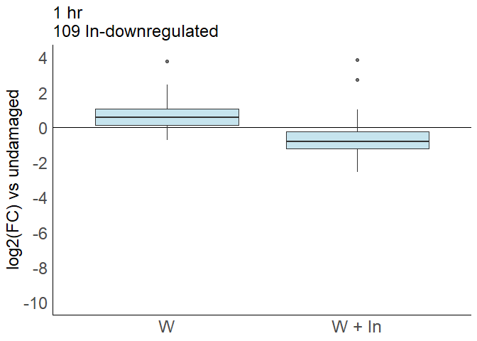<!-- -->

``` r
aa <- ggplot(inceptin1) + aes(y=log2FoldChange,x=comp) + 
  geom_hline(yintercept = 0) +
  #geom_point(cex=0.5,pch=16)
  geom_boxplot(fill=negcolor0,alpha=0.7) + 
  #geom_jitter(aes(y=log2,x=comp,col=color)) + 
  scale_x_discrete(limits=c(comp_list),labels=c("H1U1" = "W", "I1U1" = "W + In")) + 
  boxplot_theme + 
  scale_color_manual(values = c(color35)) + labs(y="log2(FC) vs undamaged",title=paste("1 hr\n",length(list0_1)," In-downregulated",sep="")) #+ 
   #stat_summary(fun.data = give.n,geom = "text")
aa
```

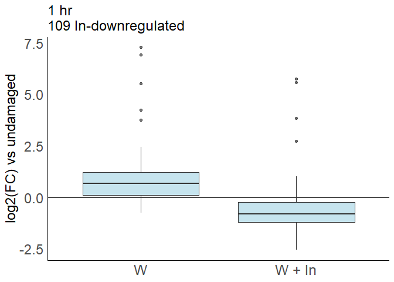<!-- -->

``` r
comp_list <- c("H1U1","I1U1")
b <- ggplot(amplify1) + aes(y=log2,x=comp) + 
  geom_hline(yintercept = 0) +
  #geom_point(cex=0.5,pch=16)
  geom_boxplot(fill=negcolor1,alpha=0.7) + 
  #geom_jitter(aes(y=log2,x=comp,col=color)) + 
  scale_x_discrete(limits=c(comp_list),labels=c("H1U1" = "W", "I1U1" = "W + In")) + 
  boxplot_theme + 
  scale_color_manual(values = c(color4)) + scale_y_continuous(breaks=seq(4,-11,-2),limit=ylim) + labs(y="log2(FC) vs undamaged",title=paste(length(list1),"In-Amplified")) #+ 
   #stat_summary(fun.data = give.n,geom = "text")

  
comp_list <- c("H1U1","I1U1","H6U1","I6U1")
d <- ggplot(accelerate1) + aes(y=log2,x=comp) + 
  geom_hline(yintercept = 0) +
  geom_vline(xintercept=2.5) +
  geom_boxplot(fill=c(negcolor3,negcolor3,negcolor7,negcolor7),alpha=0.7) + 
  scale_x_discrete(limits=c(comp_list),labels=c("H1U1" = "W", "I1U1" = "W + In", "H6U1" = "W", "I6U1" = "W + In")) + 
  boxplot_theme + 
  scale_color_manual(values = c(color6))  + scale_y_continuous(breaks=seq(4,-11,-2),limit=ylim) +
  annotate("text", size=5,x = c(1.5,3.5), y = c(10,10), label = c("1 hr", "6 hr")) + annotate("text", size=5,x = c(1.5,3.5), y = c(4,4), label = c("1 hr", "6 hr")) +
  labs(y="log2(FC) vs undamaged",title=paste(length(list3),"In-Accelerated"))
d
```

    ## Warning: Removed 284 rows containing non-finite values (stat_boxplot).

    ## Warning: Removed 2 rows containing missing values (geom_text).

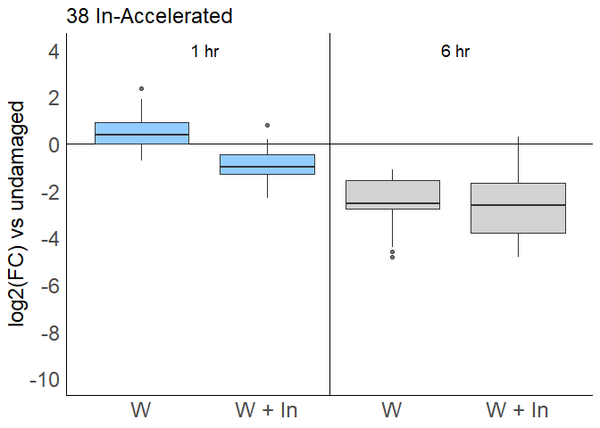<!-- -->

``` r
comp_list <- c("H1U1","I1U1")
c <- ggplot(specific1) + aes(y=log2,x=comp) + 
  geom_hline(yintercept = 0) +
  geom_boxplot(fill=negcolor2,alpha=0.7) + 
  scale_x_discrete(limits=c(comp_list),labels=c("H1U1" = "W", "I1U1" = "W + In")) + 
  boxplot_theme + 
  scale_color_manual(values = c(color5))  + scale_y_continuous(breaks=seq(4,-11,-2),limit=ylim) +
  labs(y="log2(FC) vs undamaged",title=paste(length(list2),"In-Specific"))
c
```

    ## Warning: Removed 218 rows containing missing values (stat_boxplot).

    ## Warning: Removed 82 rows containing non-finite values (stat_boxplot).

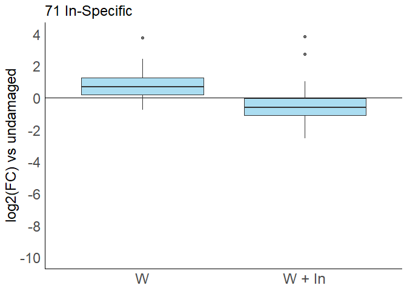<!-- -->

``` r
plot_grid(a,b,c,d)
```

    ## Warning: Removed 6 rows containing non-finite values (stat_boxplot).

    ## Warning: Removed 218 rows containing missing values (stat_boxplot).

    ## Warning: Removed 218 rows containing non-finite values (stat_boxplot).

    ## Warning: Removed 218 rows containing missing values (stat_boxplot).

    ## Warning: Removed 82 rows containing non-finite values (stat_boxplot).

    ## Warning: Removed 284 rows containing non-finite values (stat_boxplot).

    ## Warning: Removed 2 rows containing missing values (geom_text).

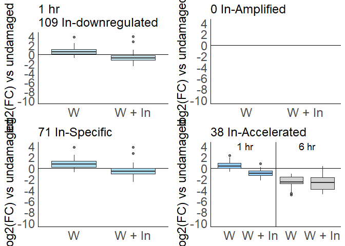<!-- -->

``` r
#6 hour

numcomp <- 2
contrastset6 <-deseq_input %>%
  filter((comp=="I6H6" & class==-1) | (comp=="H6U1" & class==1)) %>%
  group_by(gene) %>%
  filter(n()==numcomp)
contrastset6 <- intersect(c(contrastset6$gene),c(contrastset6$gene))


#inceptin up or wound up
numcomp <- 3
comp1 <- "I6U1"
comp2 <- "I6H6"
comp3 <- "H6U1"
set35 <- deseq_input %>%
  filter((comp==comp1 & class==-1) | (comp==comp2 & class==-1) | (comp==comp3 & class==-1)) %>%
  group_by(gene)
list35 <- intersect(c(set35$gene),c(set35$gene))

#just inceptin up
numcomp <- 2
comp1 <- "I6H6"
set35_1 <- deseq_input %>%
  filter((comp==comp1 & class==-1)) %>%
  group_by(gene)
list35_1 <- intersect(c(set35_1$gene),c(set35_1$gene))

##inceptin-amplified
###dmg up and inc up
numcomp <- 2
comp1 <- "H6U1"
comp2 <- "I6H6"
set4 <- deseq_input %>%
  filter((comp==comp1 & class==-1) | (comp==comp2 & class==-1)) %>%
  group_by(gene) %>%
  filter(n()==numcomp) #only keep if gene occurs twice e.g. not sig at either 1 hr or 6 hr
list4 <- intersect(c(set4$gene),c(set4$gene))

##inceptin-specific
numcomp <- 3
comp1 <- "H1U1"
comp2 <- "H6U1"
comp3 <- "I6H6"
set5 <- deseq_input %>%
  filter((comp==comp1 & class!=-1) | (comp==comp2 & class!=-1) | (comp==comp3 & class==-1)) %>%
  group_by(gene) %>%
  filter(n()==numcomp) #only keep if gene occurs twice e.g. not sig at either 1 hr or 6 hr
list5 <- intersect(c(set5$gene),c(set5$gene))


##inceptin-prolonged
numcomp <- 3
comp1 <- "H1U1"
comp2 <- "H6U1"
comp3 <- "I6H6"
set6 <- deseq_input %>%
  filter((comp==comp1 & class==-1) | (comp==comp2 & class!=-1) | (comp==comp3 & class==-1)) %>%
  group_by(gene) %>%
  filter(n()==numcomp) #only keep if gene occurs twice e.g. not sig at either 1 hr or 6 hr
list6 <- intersect(c(set6$gene),c(set6$gene))

#non duplicated overlaps
sixhr <- union(union(list4,list5),list6)
amplify_accelerate <- intersect(list4,list6)

comp_list <- c("H6U1","I6U1")
inceptin6 <- deseq_input %>% filter(gene %in% list35_1 & comp %in% comp_list)
f <- ggplot(inceptin6) + aes(y=log2FoldChange,x=comp) + 
  geom_hline(yintercept = 0) +
  #geom_point(cex=0.5,pch=16)
  geom_boxplot(fill=negcolor35,alpha=0.7) + 
  #geom_jitter(aes(y=log2,x=comp,col=color)) + 
  scale_x_discrete(limits=c(comp_list),labels=c("H6U1" = "W", "I6U1" = "W + In")) + 
  boxplot_theme + 
  scale_color_manual(values = c("red1")) + scale_y_continuous(breaks=seq(4,-11,-2),limit=ylim) + labs(y="log2(FC) vs undamaged",title=paste("6hr\n",length(list35_1)," In-downregulated",sep="")) #+ 
   #stat_summary(fun.data = give.n,geom = "text")

comp_list <- c("H1U1","I1U1","H6U1","I6U1")
amplify6 <- deseq_input %>% filter(gene %in% sixhr& comp %in% comp_list) %>% 
  mutate(color=case_when(gene %in% list4 ~ "amplified"),log2=case_when(gene %in% list4 ~ log2FoldChange))
specific6 <- deseq_input %>% filter(gene %in% sixhr& comp %in% comp_list) %>% 
  mutate(color=case_when(gene %in% list5 ~ "specific"),log2=case_when(gene %in% list5 ~ log2FoldChange))
prolong6 <- deseq_input %>% filter(gene %in% sixhr& comp %in% comp_list) %>% 
  mutate(color=case_when(gene %in% list6 ~ "accelerate"),log2=case_when(gene %in% list6 ~ log2FoldChange))


comp_list <- c("H6U1","I6U1")
g <- ggplot(amplify6) + aes(y=log2,x=comp) + 
  geom_hline(yintercept = 0) +
  geom_boxplot(fill=negcolor4,alpha=0.7) + 
  scale_x_discrete(limits=c(comp_list),labels=c("H6U1" = "W", "I6U1" = "W + In")) + 
  boxplot_theme + 
  scale_color_manual(values = c("red1")) + scale_y_continuous(breaks=seq(4,-11,-2),limit=ylim) + labs(y="log2(FC) vs undamaged",title=paste(length(list4),"In-Amplified")) #+ 
   #stat_summary(fun.data = give.n,geom = "text")

comp_list <- c("H1U1","I1U1","H6U1","I6U1")
i <- ggplot(prolong6) + aes(y=log2,x=comp) + annotate("text", size=5,x = c(1.5,3.5), y = c(10,10), label = c("1 hr", "6 hr")) + 
  geom_hline(yintercept = 0) +
    geom_vline(xintercept=2.5) +
  geom_boxplot(fill=c(negcolor7,negcolor7,negcolor6,negcolor6),alpha=0.7) + 
  scale_x_discrete(limits=c(comp_list),labels=c("H1U1" = "W", "I1U1" = "W + In", "H6U1" = "W", "I6U1" = "W + In")) + 
  boxplot_theme + 
  scale_color_manual(values = c("red3"))  + scale_y_continuous(breaks=seq(4,-11,-2),limit=ylim) + annotate("text", size=5,x = c(1.5,3.5), y = c(4,4), label = c("1 hr", "6 hr")) + labs(y="log2(FC) vs undamaged",title=paste(length(list6),"In-Prolonged")) #+ 
   #stat_summary(fun.data = give.n,geom = "text")
i
```

    ## Warning: Removed 2060 rows containing non-finite values (stat_boxplot).

    ## Warning: Removed 2 rows containing missing values (geom_text).

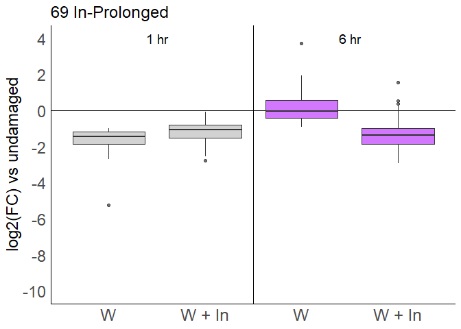<!-- -->

``` r
comp_list <- c("H6U1","I6U1")
h <- ggplot(specific6) + aes(y=log2,x=comp) + 
  geom_hline(yintercept = 0) +
  geom_boxplot(fill=negcolor5,alpha=0.7) + 
  scale_x_discrete(limits=c(comp_list)) + 
  scale_x_discrete(limits=c(comp_list),labels=c("H6U1" = "W", "I6U1" = "W + In")) + 
  boxplot_theme + 
  scale_color_manual(values = c("red2"))  + scale_y_continuous(breaks=seq(4,-11,-2),limit=ylim) + labs(y="log2(FC) vs undamaged",title=paste(length(list5),"In-Specific"))  #+ 
```

    ## Scale for 'x' is already present. Adding another scale for 'x', which will
    ## replace the existing scale.

``` r
   #stat_summary(fun.data = give.n,geom = "text")
h
```

    ## Warning: Removed 1168 rows containing missing values (stat_boxplot).

    ## Warning: Removed 448 rows containing non-finite values (stat_boxplot).

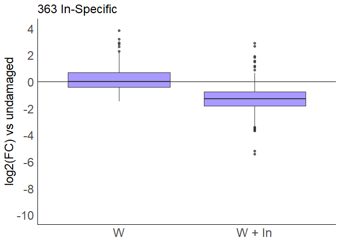<!-- -->

#### Write tables of downregulated genes

``` r
contrastdf1 <- data.frame(contrastset1)
names(contrastdf1)[1]<-"gene"
contrastdf1 <- contrastdf1 %>% left_join(annotations) %>% left_join(FCs)
```

    ## Joining, by = "gene"
    ## Joining, by = "gene"

``` r
contrastdf6 <- data.frame(contrastset6)
names(contrastdf6)[1]<-"gene"
contrastdf6 <- contrastdf6 %>% left_join(annotations) %>% left_join(FCs)
```

    ## Joining, by = "gene"
    ## Joining, by = "gene"

``` r
write_csv(contrastdf1, "boxplots/negcontrastlist1hr.csv",na="")  
write_csv(contrastdf6, "boxplots/negcontrastlist6hr.csv",na="")  

df_H1 <- data.frame(neglistH1,"*")
names(df_H1)[1]<-"gene"
names(df_H1)[2]<-"D_onehr_dmg"
df_0 <- data.frame(list0_1)
names(df_0)[1]<-"gene"
#df_1 <- data.frame(list1,"1 hr In-amplified")
#names(df_1)[1]<-"gene"
#names(df_1)[2]<-"D_in_1_subset"
df_2 <- data.frame(list2,"1 hr In-specific")
names(df_2)[1]<-"gene"
names(df_2)[2]<-"D_in_1_subset"
df_3 <- data.frame(list3,"1 hr In-accelerated")
names(df_3)[1]<-"gene"
names(df_3)[2]<-"D_in_1_subset"

negsubmerge1hr <- full_join(df_0,full_join(df_2,df_3)) %>% replace(., is.na(.), "1 hr In-induced")
```

    ## Joining, by = c("gene", "D_in_1_subset")
    ## Joining, by = "gene"

``` r
negmerge1hr <- full_join(df_H1,negsubmerge1hr) %>% left_join(annotations) %>% left_join(FCs)
```

    ## Joining, by = "gene"
    ## Joining, by = "gene"
    ## Joining, by = "gene"

``` r
df_H6 <- data.frame(neglistH6,"*")
names(df_H6)[1]<-"gene"
names(df_H6)[2]<-"D_sixhr_dmg"
df_35 <- data.frame(list35_1)
names(df_35)[1]<-"gene"
df_4 <- data.frame(list4,"6 hr In-amplified")
names(df_4)[1]<-"gene"
names(df_4)[2]<-"D_in_6_subset"
df_5 <- data.frame(list5,"6 hr In-specific")
names(df_5)[1]<-"gene"
names(df_5)[2]<-"D_in_6_subset"
df_6 <- data.frame(list6,"6 hr In-prolonged")
names(df_6)[1]<-"gene"
names(df_6)[2]<-"D_in_6_subset"

negsubmerge6hr <- full_join(df_35,full_join(df_4,full_join(df_5,df_6))) %>% replace(., is.na(.), "6 hr In-induced") 
```

    ## Joining, by = c("gene", "D_in_6_subset")

    ## Joining, by = c("gene", "D_in_6_subset")

    ## Joining, by = "gene"

``` r
negmerge6hr <- full_join(df_H6,negsubmerge6hr) %>% left_join(annotations) %>% left_join(FCs)
```

    ## Joining, by = "gene"
    ## Joining, by = "gene"
    ## Joining, by = "gene"

``` r
write_csv(negmerge6hr, "boxplots/neg6hr_list.csv",na="")  
write_csv(negmerge1hr, "boxplots/neg1hr_list.csv",na="")  

negmerge <- full_join(negmerge6hr,negmerge1hr)
```

    ## Joining, by = c("gene", "arabi-defline", "baseMean", "H1U1_log2FC", "I1U1_log2FC", "I1H1_log2FC", "H6U1_log2FC", "I6U1_log2FC", "I6H6_log2FC")

``` r
negmerge <- negmerge %>% left_join(annotations) %>% left_join(FCs)
```

    ## Joining, by = c("gene", "arabi-defline")

    ## Joining, by = c("gene", "baseMean", "H1U1_log2FC", "I1U1_log2FC", "I1H1_log2FC", "H6U1_log2FC", "I6U1_log2FC", "I6H6_log2FC")

``` r
write_csv(negmerge,"boxplots/neglists.csv",na="")


cowpea_total <- full_join(merge,negmerge)
```

    ## Joining, by = c("gene", "arabi-defline", "baseMean", "H1U1_log2FC", "I1U1_log2FC", "I1H1_log2FC", "H6U1_log2FC", "I6U1_log2FC", "I6H6_log2FC")

``` r
write_csv(cowpea_total,"boxplots/cowpea_venn.csv",na="")

FCs_new <- FCs %>% left_join(annotations,by="gene") %>% left_join(cowpea_total,by="gene")

#write gene family specific lists
POX_final <- read_csv("C:/Users/adams/Dropbox/00_UCSD/manuscript/transcriptome/Fig2/POX_final.csv",col_names = FALSE)
```

    ## Rows: 97 Columns: 1

    ## -- Column specification --------------------------------------------------------
    ## Delimiter: ","
    ## chr (1): X1

    ## 
    ## i Use `spec()` to retrieve the full column specification for this data.
    ## i Specify the column types or set `show_col_types = FALSE` to quiet this message.

``` r
POX_list <- as.list(POX_final$X1)
pox_total <- FCs_new %>% filter(gene %in% POX_list)
write_csv(pox_total,"boxplots/cowpea_pox.csv",na="")

TPS_final <- read_csv("C:/Users/adams/Dropbox/00_UCSD/manuscript/transcriptome/Fig2/TPS_final.csv",col_names = FALSE)
```

    ## Rows: 28 Columns: 1

    ## -- Column specification --------------------------------------------------------
    ## Delimiter: ","
    ## chr (1): X1

    ## 
    ## i Use `spec()` to retrieve the full column specification for this data.
    ## i Specify the column types or set `show_col_types = FALSE` to quiet this message.

``` r
TPS_list <- as.list(TPS_final$X1)
TPS_total <- FCs_new %>% filter(gene %in% TPS_list)
write_csv(TPS_total,"boxplots/cowpea_tps.csv",na="")

CML_final <- read_csv("C:/Users/adams/Dropbox/00_UCSD/manuscript/transcriptome/Fig2/CML_final.csv",col_names = FALSE)
```

    ## Rows: 32 Columns: 1

    ## -- Column specification --------------------------------------------------------
    ## Delimiter: ","
    ## chr (1): X1

    ## 
    ## i Use `spec()` to retrieve the full column specification for this data.
    ## i Specify the column types or set `show_col_types = FALSE` to quiet this message.

``` r
CML_list <- as.list(CML_final$X1)
CML_total <- FCs_new %>% filter(gene %in% CML_list)
write_csv(CML_total,"boxplots/cowpea_cml.csv",na="")

CPK_final <- read_csv("C:/Users/adams/Dropbox/00_UCSD/manuscript/transcriptome/Fig2/CPK_final.csv",col_names = FALSE)
```

    ## Rows: 35 Columns: 1

    ## -- Column specification --------------------------------------------------------
    ## Delimiter: ","
    ## chr (1): X1

    ## 
    ## i Use `spec()` to retrieve the full column specification for this data.
    ## i Specify the column types or set `show_col_types = FALSE` to quiet this message.

``` r
CPK_list <- as.list(CPK_final$X1)
CPK_total <- FCs_new %>% filter(gene %in% CPK_list)
write_csv(CPK_total,"boxplots/cowpea_cpk.csv",na="")

MAPK_final <- read_csv("C:/Users/adams/Dropbox/00_UCSD/manuscript/transcriptome/Fig2/MAPK_final.csv",col_names = FALSE)
```

    ## Rows: 8 Columns: 1

    ## -- Column specification --------------------------------------------------------
    ## Delimiter: ","
    ## chr (1): X1

    ## 
    ## i Use `spec()` to retrieve the full column specification for this data.
    ## i Specify the column types or set `show_col_types = FALSE` to quiet this message.

``` r
MAPK_list <- as.list(MAPK_final$X1)
MAPK_total <- FCs_new %>% filter(gene %in% MAPK_list)
write_csv(MAPK_total,"boxplots/cowpea_mapk.csv",na="")

ERF_final <- read_csv("C:/Users/adams/Dropbox/00_UCSD/manuscript/transcriptome/Fig2/ERF_final.csv",col_names = FALSE)
```

    ## Rows: 100 Columns: 1

    ## -- Column specification --------------------------------------------------------
    ## Delimiter: ","
    ## chr (1): X1

    ## 
    ## i Use `spec()` to retrieve the full column specification for this data.
    ## i Specify the column types or set `show_col_types = FALSE` to quiet this message.

``` r
ERF_list <- as.list(ERF_final$X1)
ERF_total <- FCs_new %>% filter(gene %in% ERF_list)
write_csv(ERF_total,"boxplots/cowpea_erf.csv",na="")

WRKY_final <- read_csv("C:/Users/adams/Dropbox/00_UCSD/manuscript/transcriptome/Fig2/WRKY_final.csv",col_names = FALSE)
```

    ## Rows: 79 Columns: 1

    ## -- Column specification --------------------------------------------------------
    ## Delimiter: ","
    ## chr (1): X1

    ## 
    ## i Use `spec()` to retrieve the full column specification for this data.
    ## i Specify the column types or set `show_col_types = FALSE` to quiet this message.

``` r
WRKY_list <- as.list(WRKY_final$X1)
WRKY_total <- FCs_new %>% filter(gene %in% WRKY_list)
write_csv(WRKY_total,"boxplots/cowpea_wrky.csv",na="")

#ALL genes in the special categories at 1 hr
overlap_all <- intersect(list0_1,list35_1)
amplified_overlap <- intersect(list1,list4)
prolong_accel_overlap <- intersect(list3,list6)
specific_overlap <- intersect(list2,list5)
length(overlap_all)
```

    ## [1] 12

``` r
library(eulerr)
fit<- euler(c("1hr"=length(list0_1)-length(overlap_all),"6hr"=length(list35_1)-length(overlap_all),"1hr&6hr"=length(overlap_all)))
k <- plot(fit,
     fills = c(negcolor0,negcolor35),
     #edges = FALSE,
     fontsize = 16,
     quantities = list(fontsize = 16))
k
```

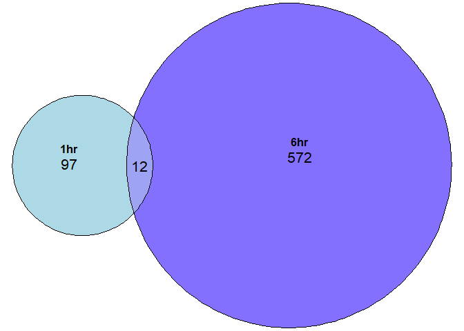<!-- -->

``` r
fit2 <- euler(c(B=length(list1)-length(amplified_overlap),G=length(list4)-length(amplified_overlap),"B&G"=length(amplified_overlap)))
l <- plot(fit2,
     fills = c(negcolor1,negcolor4),
     #edges = FALSE,
     fontsize = 16,
     quantities = list(fontsize = 16))
l
```

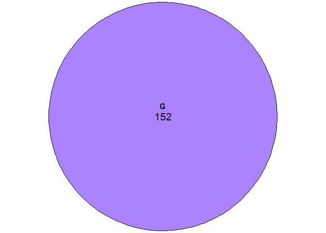<!-- -->

``` r
fit3 <- euler(c(C=length(list2)-length(specific_overlap),H=length(list5)-length(specific_overlap),"C&H"=length(specific_overlap)))
m <- plot(fit3,
     fills = c(negcolor2,negcolor5),
     #edges = FALSE,
     fontsize = 16,
     quantities = list(fontsize = 16))
m
```

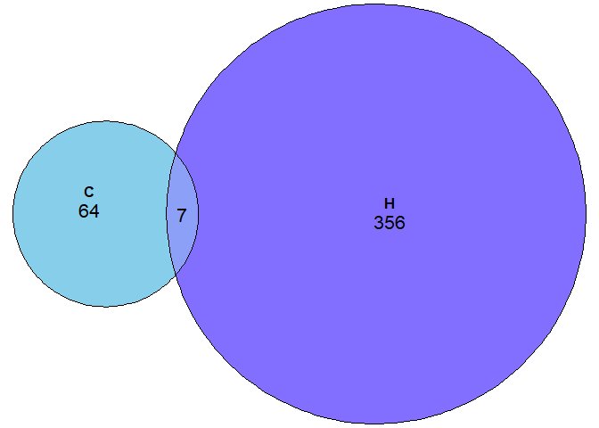<!-- -->

### Generate count vs count plots, Fig. S4

``` r
counts1 <- mutate(counts, color=
                    ifelse(gene %in% list1, "B amplified", 
                           ifelse(gene %in% list2, "C specific", 
                                  ifelse(gene %in% list3, "D accelerated","other")
                                  )
                           )
                  )
counts1 <- mutate(counts1,trans=ifelse(color=="other",0,1)) %>% 
  arrange(trans)

counts6 <- mutate(counts, color=
                    ifelse(gene %in% list4, "G amplified", 
                           ifelse(gene %in% list5, "H specific", 
                                  ifelse(gene %in% list6, "I prolonged","other")
                                  )
                           )
                  )

counts6 <- mutate(counts6,trans=ifelse(color=="other",0,1)) %>% 
  arrange(trans)


e <- ggplot(counts1) + boxplot_theme + aes(y=I1,x=H1,col=color,alpha=trans) + geom_point() + ylab(paste("log2(counts)","\n", "W + In 1 hr")) + xlab("log2(counts), Wound 1 hr") + ylim(c(-4,15)) + xlim(c(-4,15)) +  geom_abline(intercept = 0, slope = 1) + scale_color_manual(values = c(negcolor1,negcolor3,negcolor7))
j <- ggplot(counts6) + boxplot_theme + aes(y=I6,x=H6,col=color,alpha=trans) + geom_point() + ylab(paste("log2(counts)","\n", "W + In 6 hr")) + xlab("log2(counts), Wound 6 hr") + ylim(c(-4,15)) + xlim(c(-4,15)) +  geom_abline(intercept = 0, slope = 1)  + scale_color_manual(values = c(negcolor4,negcolor5,negcolor6,negcolor7))
plot_grid(e,j, labels = "AUTO", ncol=2)
```

    ## Warning: Removed 14 rows containing missing values (geom_point).

    ## Warning: Removed 7 rows containing missing values (geom_point).

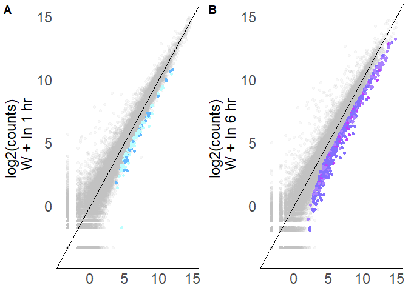<!-- -->

``` r
ggsave("boxplots/venn_down.png",k,width=4,height=3)

figure_down_new_row1 <- plot_grid(b,c,d,e,labels=c("A","B","C","D"),ncol=4,rel_widths=c(11,11,18,15.8),label_size=boxplot_font_size)
```

    ## Warning: Removed 218 rows containing missing values (stat_boxplot).

    ## Warning: Removed 218 rows containing non-finite values (stat_boxplot).

    ## Warning: Removed 218 rows containing missing values (stat_boxplot).

    ## Warning: Removed 82 rows containing non-finite values (stat_boxplot).

    ## Warning: Removed 284 rows containing non-finite values (stat_boxplot).

    ## Warning: Removed 2 rows containing missing values (geom_text).

    ## Warning: Removed 14 rows containing missing values (geom_point).

``` r
ggsave("boxplots/fig1neg_new_row1.png",figure_down_new_row1,width=15,height=3.75)

figure_down_new_row2 <- plot_grid(g,h,i,j,labels=c("E","F","G","H"),ncol=4,rel_widths=c(11,11,18,15.8),label_size=boxplot_font_size)
```

    ## Warning: Removed 1168 rows containing missing values (stat_boxplot).

    ## Warning: Removed 864 rows containing non-finite values (stat_boxplot).

    ## Warning: Removed 1168 rows containing missing values (stat_boxplot).

    ## Warning: Removed 448 rows containing non-finite values (stat_boxplot).

    ## Warning: Removed 2060 rows containing non-finite values (stat_boxplot).

    ## Warning: Removed 2 rows containing missing values (geom_text).

    ## Warning: Removed 7 rows containing missing values (geom_point).

``` r
ggsave("boxplots/fig1neg_new_row2.png",figure_down_new_row2,width=15,height=3.75)
```

### Output counts file for ggtree

``` r
counts <- mutate(counts, 
            onehr_in_color = case_when(onehr_in_up == "darkgoldenrod1" ~ "darkgoldenrod1", gene %in% listI1 ~ "black", gene %in% neglistI1 ~ "black", gene %in% negsubmerge1hr$gene ~ "steelblue1") %>% replace_na("gray50"),
            sixhr_in_color = case_when(sixhr_in_up == "red1" ~ "red1", gene %in% listI6 ~ "black", gene %in% neglistI6 ~ "black", gene %in% negsubmerge6hr$gene ~ "slateblue1") %>% replace_na("gray50"),
            onehr_dmg_color = case_when(onehr_dmg_up == "black" ~ "black", gene %in% neglistH1 ~ "black") %>% replace_na("gray50"),
            sixhr_dmg_color = case_when(sixhr_dmg_up == "black" ~ "black", gene %in% neglistH6 ~ "black") %>% replace_na("gray50"),
            onehr_in_font= case_when(onehr_in_up_font == "bold" ~ "bold", gene %in% negsubmerge1hr$gene ~ "italic",  gene %in% neglistI1 ~ "italic") %>% replace_na("plain"),
            sixhr_in_font= case_when(sixhr_in_up_font == "bold" ~ "bold", gene %in% negsubmerge6hr$gene ~ "italic",  gene %in% neglistI6 ~ "italic") %>% replace_na("plain"),
            onehr_dmg_font= case_when(onehr_dmg_up_font == "bold" ~ "bold", gene %in% neglistH1 ~ "italic") %>% replace_na("plain"),
            sixhr_dmg_font= case_when(sixhr_dmg_up_font == "bold" ~ "bold", gene %in% neglistH6 ~ "italic") %>% replace_na("plain")
                 )

write_csv(counts, "boxplots/log2counts.csv",na="")  
```

### Fig 2A volcano plots

``` r
#reset the colors so that the volcano plot displays all 1 hr and 6 hr types as the same color
color0<-"#F3E207"
color1<-"#F3E207" #lightorange
color2<-"#F3E207"
color3<-"#F3E207"
color35<-"salmon1"
color4<-"salmon1"
color5<-"salmon1"
color6<-"salmon1" #darkred
color7<-"grey"

#set negative color schemes
negcolor0<-"lightblue"
negcolor1<-"lightblue" #amp
negcolor2<-"lightblue" #specific
negcolor3<-"lightblue" #accel
negcolor35<-"lightslateblue"
negcolor4<-"lightslateblue" #amp
negcolor5<-"lightslateblue" #specific
negcolor6<-"lightslateblue" #prolong
negcolor7<-"grey"

volcano_theme <- theme(
  legend.position = "none",
  axis.text.x=element_text(size=12),
  axis.text.y=element_text(size=12),
  axis.title.x=element_text(size=14),
  axis.title.y=element_text(size=14),
  plot.margin = margin(5,20,5,5)
  )

volcano_data1 <- filter(deseq_input,comp=="I1H1") %>% left_join(negmerge, by="gene") %>% left_join(merge, by="gene") %>% mutate(minusLogP = -log(padj)) %>% unite("color", in_1_subset,D_in_1_subset,remove=FALSE)
volcano1 <- ggplot(volcano_data1) + 
  theme_minimal() + aes(y=minusLogP,x=log2FoldChange) + geom_point(size=1,col="black")+ geom_point(size=0.4,aes(col=color)) + 
  scale_color_manual(values = c(color1,color1,color1,negcolor1,negcolor1,"grey82"))+
theme(panel.background = element_rect(),panel.grid=element_blank()) + scale_x_continuous(expand=c(0.1,0.1)) + scale_y_continuous(expand=c(0,2))+ volcano_theme + xlab("log2FoldChange, W+In vs W") +ylab("-log(p)") +geom_rect(mapping=aes(xmin=-5,xmax=5,ymin=0,ymax=60),fill=NA,color="black")
volcano1_sub <- volcano1 + scale_x_continuous(limits=c(-5,5),expand=c(0,0)) + scale_y_continuous(limits=c(0,60),expand=c(0,0))
```

    ## Scale for 'x' is already present. Adding another scale for 'x', which will
    ## replace the existing scale.

    ## Scale for 'y' is already present. Adding another scale for 'y', which will
    ## replace the existing scale.

``` r
volcano1
```

    ## Warning: Removed 11783 rows containing missing values (geom_point).

    ## Warning: Removed 11783 rows containing missing values (geom_point).

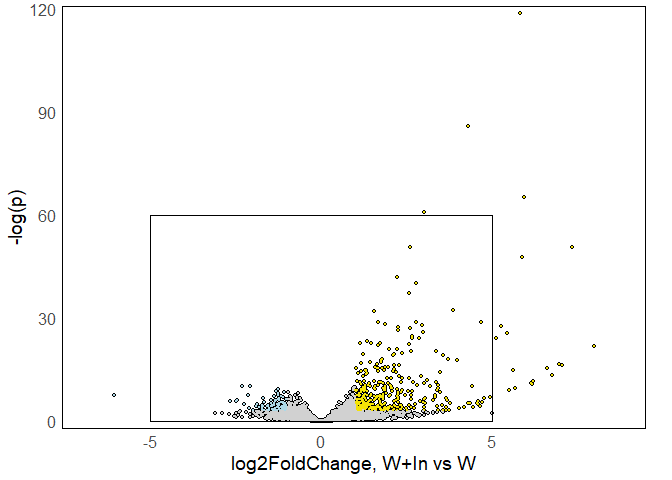<!-- -->

``` r
volcano1_sub
```

    ## Warning: Removed 11804 rows containing missing values (geom_point).

    ## Warning: Removed 11804 rows containing missing values (geom_point).

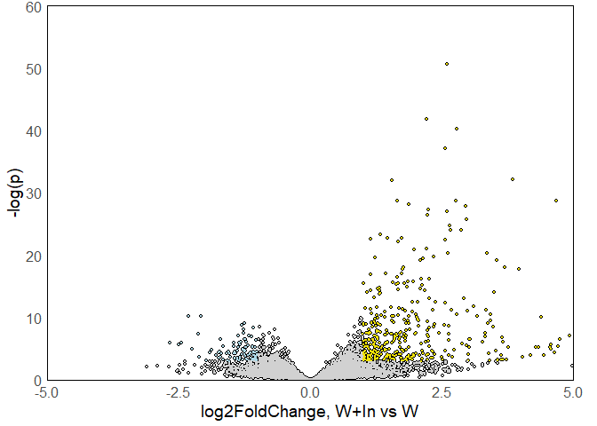<!-- -->

``` r
  #scale_color_manual(values = c(color2,color1,color0,color3,negcolor3,negcolor0,negcolor2,"grey82"))

volcano_data6 <- filter(deseq_input,comp=="I6H6") %>% left_join(negmerge, by="gene") %>% left_join(merge, by="gene") %>% mutate(minusLogP = -log(padj)) %>% unite("color", in_6_subset,D_in_6_subset,remove=FALSE)
volcano6 <- ggplot(volcano_data6) + theme_minimal() + aes(y=minusLogP,x=log2FoldChange,col=color) + geom_point(size=1,col="black")+ geom_point(size=0.4,aes(col=color)) + scale_color_manual(values = c(color4,color4,color4,negcolor4,negcolor4,negcolor4,"grey82"))+ theme(panel.background = element_rect(),panel.grid=element_blank()) + scale_x_continuous(expand=c(0.1,0.1)) + scale_y_continuous(expand=c(0,2))+ volcano_theme + xlab("log2FoldChange, W+In vs W") +ylab("-log(p)")+geom_rect(mapping=aes(xmin=-5,xmax=5,ymin=0,ymax=60),fill=NA,color="black")
volcano6_sub <- volcano6   + scale_x_continuous(limits=c(-5,5),expand=c(0,0)) + scale_y_continuous(limits=c(0,60),expand=c(0,0))
```

    ## Scale for 'x' is already present. Adding another scale for 'x', which will
    ## replace the existing scale.
    ## Scale for 'y' is already present. Adding another scale for 'y', which will
    ## replace the existing scale.

``` r
volcano6
```

    ## Warning: Removed 11298 rows containing missing values (geom_point).

    ## Warning: Removed 11298 rows containing missing values (geom_point).

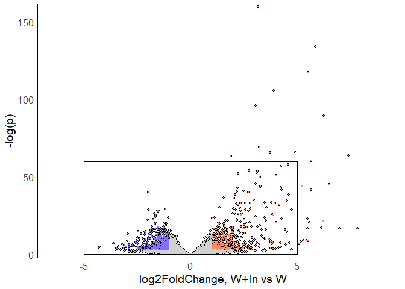<!-- -->

``` r
volcano6_sub
```

    ## Warning: Removed 11325 rows containing missing values (geom_point).

    ## Warning: Removed 11325 rows containing missing values (geom_point).

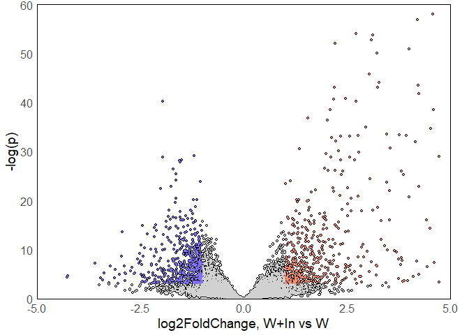<!-- -->

``` r
volcano1_fig <- plot_grid(volcano1,volcano1_sub)
```

    ## Warning: Removed 11783 rows containing missing values (geom_point).

    ## Warning: Removed 11783 rows containing missing values (geom_point).

    ## Warning: Removed 11804 rows containing missing values (geom_point).

    ## Warning: Removed 11804 rows containing missing values (geom_point).

``` r
ggsave("boxplots/volcano1.png",volcano1_fig,width=6,height=3)

volcano6_fig <- plot_grid(volcano6,volcano6_sub)
```

    ## Warning: Removed 11298 rows containing missing values (geom_point).

    ## Warning: Removed 11298 rows containing missing values (geom_point).

    ## Warning: Removed 11325 rows containing missing values (geom_point).

    ## Warning: Removed 11325 rows containing missing values (geom_point).

``` r
ggsave("boxplots/volcano6.png",volcano6_fig,width=6,height=3)
```
