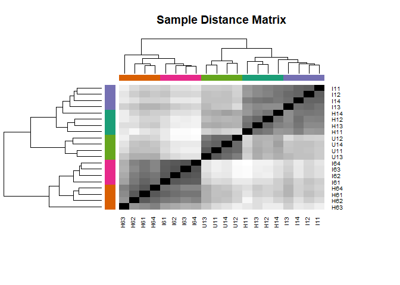

DESeq Analysis for cowpea 2021 manuscript
================
Adam Steinbrenner
August 11, 2021

## Install packages

    if (!requireNamespace("BiocManager", quietly = TRUE))
        install.packages("BiocManager")
    BiocManager::install("DESeq2")

## Open libraries

``` r
library(DESeq2)
library(dplyr)
library(gplots)
library(RColorBrewer)
library(stringr)
```

## Load htseq counts data

``` r
setwd("C:/Users/Adams/Dropbox/00_UCSD/UW/github/cowpea_transcriptome_2021")

#input data
countdata <- read.table("input_combined_counts.csv", header=TRUE,sep=",",row.names = 1)
```

## Format data and set conditions by column

``` r
countdata <- as.matrix(countdata)
head(countdata)
```

    ##                     H11 H12 H13 H14 H61 H62 H63 H64 I11 I12 I13 I14 I61 I62 I63
    ## Vigun01g000100.v1.1   3   2   8   0   8  10   1  14   2   1   4   2   5   8  11
    ## Vigun01g000200.v1.1 131 134 193 193 305 301 132 274 202 257 320 189 251 229 292
    ## Vigun01g000300.v1.1   1   3   6   8  11  43  10   6   6  13   1   2   7   0  14
    ## Vigun01g000400.v1.1  16   8  16   9  26  22   4  10   7   8  20   9  14  11  16
    ## Vigun01g000500.v1.1  30  20  14  19  30  28  39  27  20  19  25  22  27  38  41
    ## Vigun01g000600.v1.1   0   0   0   0   0   0   0   0   0   0   0   0   0   0   0
    ##                     I64 U11 U12 U13 U14
    ## Vigun01g000100.v1.1   6   5  13   5   5
    ## Vigun01g000200.v1.1 275 252 243 256 141
    ## Vigun01g000300.v1.1  29  12  13  10  11
    ## Vigun01g000400.v1.1  10  21  20  16  16
    ## Vigun01g000500.v1.1  30  34  23  28  23
    ## Vigun01g000600.v1.1   0   0   0   0   0

``` r
colnames(countdata)
```

    ##  [1] "H11" "H12" "H13" "H14" "H61" "H62" "H63" "H64" "I11" "I12" "I13" "I14"
    ## [13] "I61" "I62" "I63" "I64" "U11" "U12" "U13" "U14"

``` r
#set conditions for each set of columns
(condition <- factor(c(
 rep("H1",4),
 rep("H6",4),
 rep("I1",4),
 rep("I6",4),
 rep("U1",4)
 )
 )
 )
```

    ##  [1] H1 H1 H1 H1 H6 H6 H6 H6 I1 I1 I1 I1 I6 I6 I6 I6 U1 U1 U1 U1
    ## Levels: H1 H6 I1 I6 U1

## DESeq functions

``` r
(coldata <- data.frame(row.names=colnames(countdata), condition))
```

    ##     condition
    ## H11        H1
    ## H12        H1
    ## H13        H1
    ## H14        H1
    ## H61        H6
    ## H62        H6
    ## H63        H6
    ## H64        H6
    ## I11        I1
    ## I12        I1
    ## I13        I1
    ## I14        I1
    ## I61        I6
    ## I62        I6
    ## I63        I6
    ## I64        I6
    ## U11        U1
    ## U12        U1
    ## U13        U1
    ## U14        U1

``` r
dds <- DESeqDataSetFromMatrix(countData=countdata, colData=coldata, design=~condition)
dds 
```

    ## class: DESeqDataSet 
    ## dim: 29773 20 
    ## metadata(1): version
    ## assays(1): counts
    ## rownames(29773): Vigun01g000100.v1.1 Vigun01g000200.v1.1 ...
    ##   VigunL089100.v1.1 VigunL089200.v1.1
    ## rowData names(0):
    ## colnames(20): H11 H12 ... U13 U14
    ## colData names(1): condition

``` r
dds <- DESeq(dds)
```

    ## estimating size factors

    ## estimating dispersions

    ## gene-wise dispersion estimates

    ## mean-dispersion relationship

    ## final dispersion estimates

    ## fitting model and testing

\#Dispersion plots, heatmap of samples, and PCA

``` r
plotDispEsts(dds, main="Dispersion plot")
```

<!-- -->

``` r
rld <- rlogTransformation(dds)
head(assay(rld))
```

    ##                          H11      H12      H13      H14      H61      H62
    ## Vigun01g000100.v1.1 1.961990 1.949861 2.585670 1.588325 2.350384 2.450941
    ## Vigun01g000200.v1.1 7.170570 7.483492 7.710583 7.960793 7.781523 7.707393
    ## Vigun01g000300.v1.1 2.119370 2.564814 2.850352 3.209956 2.990376 4.060843
    ## Vigun01g000400.v1.1 3.745903 3.483164 3.899037 3.656190 3.987909 3.800773
    ## Vigun01g000500.v1.1 4.699122 4.629196 4.256776 4.697296 4.542747 4.434783
    ## Vigun01g000600.v1.1 0.000000 0.000000 0.000000 0.000000 0.000000 0.000000
    ##                          H63      H64      I11      I12      I13      I14
    ## Vigun01g000100.v1.1 1.679640 2.790439 2.026977 1.824189 2.109415 1.927696
    ## Vigun01g000200.v1.1 7.200088 7.768311 8.062771 8.281340 8.066888 7.755659
    ## Vigun01g000300.v1.1 3.070366 2.675718 3.049495 3.618079 2.139579 2.387790
    ## Vigun01g000400.v1.1 2.935519 3.348636 3.524692 3.597717 3.967429 3.523084
    ## Vigun01g000500.v1.1 4.951579 4.533582 4.788633 4.725311 4.593160 4.661516
    ## Vigun01g000600.v1.1 0.000000 0.000000 0.000000 0.000000 0.000000 0.000000
    ##                          I61      I62      I63      I64      U11      U12
    ## Vigun01g000100.v1.1 2.223794 2.472945 2.602614 2.200766 2.198803 2.836993
    ## Vigun01g000200.v1.1 7.834253 7.701579 7.810191 7.704963 7.791861 7.792341
    ## Vigun01g000300.v1.1 2.859836 1.948489 3.216486 3.779440 3.194895 3.282606
    ## Vigun01g000400.v1.1 3.692210 3.486742 3.660369 3.302651 3.974882 3.964439
    ## Vigun01g000500.v1.1 4.663187 4.920827 4.873030 4.562796 4.820433 4.522026
    ## Vigun01g000600.v1.1 0.000000 0.000000 0.000000 0.000000 0.000000 0.000000
    ##                          U13      U14
    ## Vigun01g000100.v1.1 2.254753 2.478864
    ## Vigun01g000200.v1.1 7.910551 7.723670
    ## Vigun01g000300.v1.1 3.137164 3.507138
    ## Vigun01g000400.v1.1 3.839266 4.162240
    ## Vigun01g000500.v1.1 4.743537 4.920656
    ## Vigun01g000600.v1.1 0.000000 0.000000

``` r
hist(assay(rld))
```

<!-- -->

``` r
(mycols <- brewer.pal(8, "Dark2")[1:length(unique(condition))])
```

    ## [1] "#1B9E77" "#D95F02" "#7570B3" "#E7298A" "#66A61E"

``` r
sampleDists <- as.matrix(dist(t(assay(rld))))

#heatmap
heatmap.2(as.matrix(sampleDists), key=F, trace="none",
          col=colorpanel(100, "black", "white"),
          ColSideColors=mycols[condition], RowSideColors=mycols[condition],
          margin=c(10, 10), main="Sample Distance Matrix")
```

<!-- -->

``` r
png("deseq/qc-heatmap-samples.png", w=1000, h=1000, pointsize=20)
heatmap.2(as.matrix(sampleDists), key=F, trace="none",
          col=colorpanel(100, "black", "white"),
          ColSideColors=mycols[condition], RowSideColors=mycols[condition],
          margin=c(10, 10), main="Sample Distance Matrix")
dev.off()
```

    ## png 
    ##   2

``` r
#PCA plot
DESeq2::plotPCA(rld, intgroup="condition")
```

<!-- -->

``` r
png("deseq/pca.png")
DESeq2::plotPCA(rld, intgroup="condition")
dev.off()
```

    ## png 
    ##   2

## write normalized and log2-corrected counts files

``` r
#write.csv(resdata, file="diffexpr-results.csv")
counts<-as.data.frame(counts(dds, normalized=TRUE))
counts[counts==0]<-0.1
write.csv(counts,file="deseq/counts.csv")

log2counts <- log2(counts)
write.csv(log2counts,file="deseq/log2counts.csv")

avglog2 <- log2counts %>% mutate(U1 = rowMeans(select(., starts_with("U1")), na.rm = TRUE)) %>% mutate(H1 = rowMeans(select(., starts_with("H1")), na.rm = TRUE)) %>% mutate(H6 = rowMeans(select(., starts_with("H6")), na.rm = TRUE)) %>% mutate(I1 = rowMeans(select(., starts_with("I1")), na.rm = TRUE)) %>% mutate(I6 = rowMeans(select(., starts_with("I6")), na.rm = TRUE)) %>% select(21:25)
#rownames(avglog2) <- str_sub(all$gene,end=-6)

rownames(avglog2) <- str_sub(rownames(avglog2),end=-6)
avglog2 <- cbind(rownames(avglog2), data.frame(avglog2, row.names=NULL))
colnames(avglog2)[1] <- "gene"
write.csv(avglog2,file="deseq/counts_avg_log2.csv",row.names=FALSE)
```

### For differential comparisons, add contrast option to a DEseq2 object (dds). Specify using contrast=c(*name of column with conditions*,*denominator*,*numerator*)

``` r
resI1H1 <- data.frame(results(dds, contrast=c("condition","I1","H1")))
resI6H6 <- data.frame(results(dds, contrast=c("condition","I6","H6")))
resI6I1 <- data.frame(results(dds, contrast=c("condition","I6","I1")))
resH6H1 <- data.frame(results(dds, contrast=c("condition","H6","H1")))
resH1U1 <- data.frame(results(dds, contrast=c("condition","H1","U1")))
resI1U1 <- data.frame(results(dds, contrast=c("condition","I1","U1")))
resH6U1 <- data.frame(results(dds, contrast=c("condition","H6","U1")))
resI6U1 <- data.frame(results(dds, contrast=c("condition","I6","U1")))

resI1H1$gene<-rownames(resI1H1)
resI6H6$gene<-rownames(resI6H6)
resI6I1$gene<-rownames(resI6I1)
resH6H1$gene<-rownames(resH6H1)
resH1U1$gene<-rownames(resH1U1)
resI1U1$gene<-rownames(resI1U1)
resH6U1$gene<-rownames(resH6U1)
resI6U1$gene<-rownames(resI6U1)
```

## Use dplyr to filter by significance and write log2 count for only genes with a significant DE. Then merge dataframes and export

``` r
dfs <- list(resH1U1,resI1U1,resH6U1,resI6U1)
allDE <- bind_rows(dfs,.id=NULL) %>% filter(padj<0.05) %>% distinct(gene)
log2counts$gene <- rownames(log2counts)
DE_log2_norm_counts <- left_join(allDE,log2counts,by="gene")
library(readr)
write_csv(DE_log2_norm_counts,"deseq/DE_log2_norm_counts.csv")
```

## Calculate average counts to generate heatmap

``` r
positions<-c(23:26)
DE_log2_avg <- DE_log2_norm_counts %>% rowwise() %>% mutate(Undamaged=mean(c(U11,U12,U13,U14))) %>% mutate(Damage_1hr=mean(c(H11,H12,H13,H14))-Undamaged) %>% mutate(DamageInceptin_1hr=mean(c(I11,I12,I13,I14))-Undamaged) %>% mutate(Damage_6hr=mean(c(H61,H62,H63,H64))-Undamaged) %>%  mutate(DamageInceptin_6hr=mean(c(I61,I62,I63,I64))-Undamaged) %>% select(all_of(positions))

heatmap <- as.matrix(DE_log2_avg)


row.hc <- hclust(dist(heatmap))
row.dd <- as.dendrogram(row.hc)


png("deseq/heatmap.png", w=600, h=1000, pointsize=20)
heatmap.2(heatmap, Rowv=row.dd, col = colorRampPalette(c('blue1','blue2','blue3','blue4','black','green4','green3','green2','green1'))(20), scale="none", key=T, keysize=1.5,density.info="none", trace="none",cexCol=0.6, labRow=NA)
dev.off()
```

    ## png 
    ##   2

``` r
pdf("deseq/heatmap.pdf")
heatmap.2(heatmap, Rowv=row.dd, col = colorRampPalette(c('blue1','blue2','blue3','blue4','black','green4','green3','green2','green1'))(20), scale="none", key=T, keysize=1.5,density.info="none", trace="none",cexCol=0.6, labRow=NA)
dev.off()
```

    ## png 
    ##   2

## Create a tidy output for dplyr analysis and boxplot scripts

``` r
resI1H1$comp<-"I1H1"
resI6H6$comp<-"I6H6"
resI6I1$comp<-"I6I1"
resH6H1$comp<-"H6H1"
resH1U1$comp<-"H1U1"
resI1U1$comp<-"I1U1"
resH6U1$comp<-"H6U1"
resI6U1$comp<-"I6U1"

resI1H1 <- mutate(resI1H1,id=row_number())
resI6H6 <- mutate(resI6H6,id=row_number())
resI6I1 <- mutate(resI6I1,id=row_number())
resH6H1 <- mutate(resH6H1,id=row_number())
resH1U1 <- mutate(resH1U1,id=row_number())
resI1U1 <- mutate(resI1U1,id=row_number())
resH6U1 <- mutate(resH6U1,id=row_number())
resI6U1 <- mutate(resI6U1,id=row_number())

dfs <- list(resI1H1,resI6H6,resI6I1,resH6H1,resH1U1,resI1U1,resH6U1,resI6U1)

all <- bind_rows(dfs,.id=NULL)
all <- bind_rows(dfs)
library(stringr)
#rename all rows as genes rather than transcripts
all$gene <- str_sub(all$gene,end=-6)

#csv output
write.csv(all,file="deseq/DESeq_allcomps.csv")
```

## A final human-readable output is all DESeq comparisons organized by gene, rather than tidy format

``` r
#rename column headers with the exact comparison used
resI1H1 <- data.frame(results(dds, contrast=c("condition","I1","H1")))
resI6H6 <- data.frame(results(dds, contrast=c("condition","I6","H6")))
resI6I1 <- data.frame(results(dds, contrast=c("condition","I6","I1")))
resH6H1 <- data.frame(results(dds, contrast=c("condition","H6","H1")))
resH1U1 <- data.frame(results(dds, contrast=c("condition","H1","U1")))
resI1U1 <- data.frame(results(dds, contrast=c("condition","I1","U1")))
resH6U1 <- data.frame(results(dds, contrast=c("condition","H6","U1")))
resI6U1 <- data.frame(results(dds, contrast=c("condition","I6","U1")))

colnames(resI1H1)<-paste("I1H1",colnames(resI1H1))
colnames(resI6H6)<-paste("I6H6",colnames(resI6H6))
colnames(resI6I1)<-paste("I6I1",colnames(resI6I1))
colnames(resH6H1)<-paste("H6H1",colnames(resH6H1))
colnames(resH1U1)<-paste("H1U1",colnames(resH1U1))
colnames(resI1U1)<-paste("I1U1",colnames(resI1U1))
colnames(resH6U1)<-paste("H6U1",colnames(resH6U1))
colnames(resI6U1)<-paste("I6U1",colnames(resI6U1))


resI1H1$gene<-rownames(resI1H1)
resI6H6$gene<-rownames(resI6H6)
resI6I1$gene<-rownames(resI6I1)
resH6H1$gene<-rownames(resH6H1)
resH1U1$gene<-rownames(resH1U1)
resI1U1$gene<-rownames(resI1U1)
resH6U1$gene<-rownames(resH6U1)
resI6U1$gene<-rownames(resI6U1)


resI1H1$comp<-"I1H1"
resI6H6$comp<-"I6H6"
resI6I1$comp<-"I6I1"
resH6H1$comp<-"H6H1"
resH1U1$comp<-"H1U1"
resI1U1$comp<-"I1U1"
resH6U1$comp<-"H6U1"
resI6U1$comp<-"I6U1"

#write row number
resI1H1 <- mutate(resI1H1,id=row_number())
resI6H6 <- mutate(resI6H6,id=row_number())
resI6I1 <- mutate(resI6I1,id=row_number())
resH6H1 <- mutate(resH6H1,id=row_number())
resH1U1 <- mutate(resH1U1,id=row_number())
resI1U1 <- mutate(resI1U1,id=row_number())
resH6U1 <- mutate(resH6U1,id=row_number())
resI6U1 <- mutate(resI6U1,id=row_number())

dfs <- list(resI1H1,resI6H6,resI6I1,resH6H1,resH1U1,resI1U1,resH6U1,resI6U1)

all <- bind_rows(dfs,.id=NULL)
all <- bind_rows(dfs)
output <- Reduce(function(x, y) merge(x, y, all=TRUE,by="gene"), dfs)
```

    ## Warning in merge.data.frame(x, y, all = TRUE, by = "gene"): column names
    ## 'comp.x', 'id.x', 'comp.y', 'id.y' are duplicated in the result

    ## Warning in merge.data.frame(x, y, all = TRUE, by = "gene"): column names
    ## 'comp.x', 'id.x', 'comp.y', 'id.y' are duplicated in the result

    ## Warning in merge.data.frame(x, y, all = TRUE, by = "gene"): column names
    ## 'comp.x', 'id.x', 'comp.y', 'id.y', 'comp.x', 'id.x', 'comp.y', 'id.y' are
    ## duplicated in the result

    ## Warning in merge.data.frame(x, y, all = TRUE, by = "gene"): column names
    ## 'comp.x', 'id.x', 'comp.y', 'id.y', 'comp.x', 'id.x', 'comp.y', 'id.y' are
    ## duplicated in the result

    ## Warning in merge.data.frame(x, y, all = TRUE, by = "gene"): column names
    ## 'comp.x', 'id.x', 'comp.y', 'id.y', 'comp.x', 'id.x', 'comp.y', 'id.y',
    ## 'comp.x', 'id.x', 'comp.y', 'id.y' are duplicated in the result

``` r
write.csv(output, file="deseq/deseqResults_bygene.csv")
```
